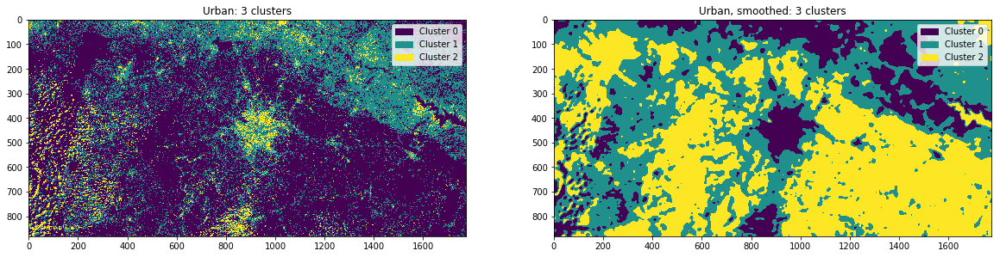
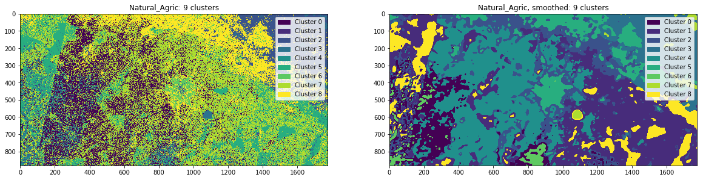

# bristol_data_dive  - Applying clustering to identify land use in Satellite imagery
Repo for work from the Bristol data dive: http://www.data4sdgs.org/news/bristol-data-dive

Edward Rowland - Big Data Team - Office for National Statistics, UK

**email:** edward.rowland@ons.gov.uk

**phone:** 01633 455712


```python
import os

#data manipulation
import numpy as np
import pandas as pd

#reading and displying images
import matplotlib.pyplot as plt
import matplotlib.patches as pat
import seaborn as sns

#displying data
from IPython.display import display

#the K-means implementation
from sklearn.cluster import KMeans

#guassaian smoothing
from scipy.ndimage import gaussian_filter

#inline plots
%matplotlib inline
plt.rcParams["figure.figsize"] = (20,20)
```

# The Data

Lets try some satellite images from: https://apps.sentinel-hub.com/sentinel-playground

We load several images to try. One is the natural image; what you see with your eyes.
The others include several different spectra highlighing argicultural, urban and vegetation.


```python
files = ["Sentinel-2 image on 2018-012-natural.jpg",
         "Sentinel-2 image on 2018-01-12-agric.jpg",
         "Sentinel-2 image on 2018-01-12-urban.jpg",
         "Sentinel-2 image on 2018-01-12-vegetation.jpg"
        ]

names = ["Natural",
         "Agricultural",
         "Urban",
         "Vegetation"]
```

Let's read the files into a dict


```python
file_dir = "../data/ghana_data/"

images = [plt.imread(file_dir + file) for file in files]
images = dict(zip(names, images))
```

## Pre-processing the image

We can try to pre-process the image by applying a gaussian smoothing function. This will mean we lose some fine detail but we are not interested in that anyway.

This will give us some idea if pre-processing is best for the images.


```python
smooth_imgs = []

for name in names:
    smooth_imgs.append(gaussian_filter(images[name], sigma = [5,5,0]))

smooth_images = dict(zip(names, smooth_imgs))
```

Ok, let's look at the images


```python
for name in names:

    fig, axs = plt.subplots(1,2)
    axs[0].imshow(images[name])
    axs[0].set_title(name + ": Unprocessed")
    axs[1].imshow(smooth_images[name])
    axs[1].set_title(name + ": Smoothed")
    plt.show()
```


We can see the main city in the centre of the images with a mountainous area in the top and right of the image. The white speckled bits are cloud. Overall it is a pretty clear image, there is a darker region to the left which is where one satellite image has been stitched together with another.

We can see the difference in fine detail lost after the smoothing. But that might suit us as we are not interested in the fine detail

## Clustering

Here we define a function that runs our k-means clustering algorithm.

Clustering is an unsupervised machine learning approach. This means the data does not contain labels, so we do not tell the algorithm what class a particular observation (in this case a pixel in the image) should have. Instead, the algorithm looks at the distribution of the various features (in our case the amount of red, green and blue of each pixel) and tells us how the data is best grouped into classes.

Clustering algorithms can be sensitive to the starting parameters, so we should try the approach with a few different parameters.

K-Means is a pretty straightfoward approach to clustering.

In K-Means, k is the number of clusters we want it to find, which we define beforehand. As K-Means is sensitive to starting parameters, we will try several different values for K.

The broad steps for the algorithm are as follows

1. Select the centroids for each of the K clusters - this can be done by randomly selecting an observation in our dataset or by defining them beforehand. Here we select them randomly.
2. For each observation, it calculates the euclidian distance in the feature space to the centroid of each cluster each datapoint is assigned to the cluster that has shortest euclidian distance. Simply put: it assigns each datapoint to the closest cluster.
3. The centroids for each cluster are recalculated based upon the mean (hence the name) of the features across all the observations' grouped in that cluster.
4. Repeat from step 2 until a stopping condition is met. Examples of these are: no observation changes cluster, the sum of the euclian distances of each observation and the centroid of its cluster drops below a threshold or a maximum number of iterations is reached.

Below is the code to compute clusters. This uses the scikit-learn implementation of K-Means documented here: http://scikit-learn.org/stable/modules/generated/sklearn.cluster.KMeans.html

## Functions

### Creating clusters

Here we create two functions. The first, cluster_image contains the code to run the k-means algorithm on the data. The second runs the k_means with multiple values for k and gets the results


```python
def cluster_image(groups, img, method = "random"):
    """cluster_image
    Takes an image, represented as a numpy array and attempts to cluster the pixels
    in the image into a specified number of groups.
    By default uses random starting clusters with a specified random seed

    Args:
        groups (int): The number of groups to cluster the data into (k)
        img (Array): The image of dimensions (x,y,z) where z is the features to cluster over
        method (String): Initial starting method to use, random by default.
            See: http://scikit-learn.org/stable/modules/generated/sklearn.cluster.KMeans.html

    Returns:
        cluster_labels (Array): Contains cluster labels for img in a 2-D array of the same size as the first two
            dimensions of img

    """

    #put into the right shape
    dims = np.shape(img)
    img_matrix = np.reshape(img, (dims[0] * dims[1], dims[2]))

    #cluster
    cl = KMeans(n_clusters = groups, init = method)
    img_groups = cl.fit_predict(img_matrix)

    #create image
    cluster_groups = np.reshape(img_groups, (dims[0], dims[1]))

    return cluster_groups
```


```python
def cluster_ks(image, ks):

    """cluster_ks
    Wrapper for cluster image. Repeats clustering for a range of values.

    Args:
        image (Array): The image of dimensions (x,y,z) where z is the features to cluster over
        ks (iterable): integer values of k to cluster with

    Returns:
        (dict): key:value pair where key is k clusters and value is the results in a numpy array

    """

    cluster_labels = []

    for k in ks:

        #get cluster groups
        group_labels = cluster_image(groups = k, img = image)
        cluster_labels.append(group_labels)


    clusters = [str(k) for k in ks]
    return dict(zip(clusters,cluster_labels))
```

### Visualising results

plt_results plots the group of each pixel, formatted in an array of the same size and shape of the original image and organised them by number of clusters for the smoothed and unsmoothed image. It also plots the pixel counts, ratios and percentages of each group, from the output of calc_counts.


```python
def plt_results(ks,
                imgs,
                smoothed_imgs,
                img_name,
                file_type = ".png",
                save_dir = "../results/clustering/"
               ):

    """plt_results

    Plot results from smoothed and unsmoothed images side by side

    Args:
        ks (iterable): the value for k used to cluster
        img (dict): cluster results from unsmoothed image
        smoothed_img (dict): cluster results from smoothed image
        img_name (string): name of the image the results are for
        file_type (string): image file extention for saving, must be something that matplotlib can render
        save_dir (string): directory to save the images to

    Returns:
        figs (List): the figures created from the results
    """

    figs =[]
    for k in range(3,10):
        fig, axs = plt.subplots(1,2)

        im = axs[0].imshow(imgs[str(k)])
        handle = make_legend_handles(img = im,
                                     n_clusters = k
                                    )
        axs[0].legend(handles = handle)
        axs[0].set_title(img_name + ": {} clusters".format(k))

        im = axs[1].imshow(smoothed_imgs[str(k)])
        handle = make_legend_handles(img = im,
                             n_clusters = k
                            )
        axs[1].legend(handles = handle)
        axs[1].set_title(img_name + ", smoothed: {} clusters".format(k))


        plt.show()

        #get the counts
        img_res_df = calc_counts(imgs[str(k)])
        smooth_img_res_df = calc_counts(smoothed_imgs[str(k)])
        #put them together
        res_df = pd.concat([img_res_df, smooth_img_res_df],
                           axis = 1,
                           keys = ["unsmoothed", "smoothed"]
                          )  
        display(res_df)

        if save_dir is not None:
            img_file = save_dir + img_name + "_{}-clusters".format(k) + file_type
            fig.savefig(img_file)
            res_file = save_dir + img_name + "_{}-clusters.csv".format(k)
            res_df.to_csv(res_file)
        figs.append(fig)

    return

```


```python
def make_legend_handles(img, n_clusters):
    """make_legend_handles

    creates handles for use with legend

    Args:
        img (ListedColourmap): the image for the legend
        n_clusters (int): number of clusters

    """
    #create colours
    colours = [img.cmap(img.norm(cluster)) for cluster in range(n_clusters)]
    #use a list of Patch objects for the handle
    handles = []
    for cluster in range(n_clusters):
        handles.append(pat.Patch(color = colours[cluster], label = "Cluster {}".format(cluster)))

    return handles
```


```python
def calc_counts(results):
    """calc_counts

    Computes and returns counts and ratios for number of pixels in the image within each cluster

    Args:
        results (Array): 2D array of cluster labels
    Returns
        df (DataFrame): contains the counts, ratios and percentages of each cluster

    """
    uni, counts = np.unique(results, return_counts = True)
    df = pd.DataFrame({"cluster": uni,
                  "pixel_count" : counts})

    df["ratio"] = df["pixel_count"].divide(df["pixel_count"].sum())
    df["% total"] = df["ratio"].multiply(100)
    df.set_index("cluster", inplace = True)
    return df

```

## Natural image

Lets run this with the Natural image


```python
nat_results = cluster_ks(images["Natural"], range(3,10))
nat_smooth_results = cluster_ks(smooth_images["Natural"], range(3,10))
```


```python
plt_results(ks = range(3,10),
            imgs = nat_results,
            smoothed_imgs = nat_smooth_results,
            img_name = "Natural"
           )
```


<div>
<style scoped>
    .dataframe tbody tr th:only-of-type {
        vertical-align: middle;
    }

    .dataframe tbody tr th {
        vertical-align: top;
    }

    .dataframe thead tr th {
        text-align: left;
    }

    .dataframe thead tr:last-of-type th {
        text-align: right;
    }
</style>
<table border="1" class="dataframe">
  <thead>
    <tr>
      <th></th>
      <th colspan="3" halign="left">unsmoothed</th>
      <th colspan="3" halign="left">smoothed</th>
    </tr>
    <tr>
      <th></th>
      <th>pixel_count</th>
      <th>ratio</th>
      <th>% total</th>
      <th>pixel_count</th>
      <th>ratio</th>
      <th>% total</th>
    </tr>
    <tr>
      <th>cluster</th>
      <th></th>
      <th></th>
      <th></th>
      <th></th>
      <th></th>
      <th></th>
    </tr>
  </thead>
  <tbody>
    <tr>
      <th>0</th>
      <td>31707</td>
      <td>0.020253</td>
      <td>2.025295</td>
      <td>923487</td>
      <td>0.589880</td>
      <td>58.988023</td>
    </tr>
    <tr>
      <th>1</th>
      <td>405611</td>
      <td>0.259085</td>
      <td>25.908531</td>
      <td>561515</td>
      <td>0.358669</td>
      <td>35.866948</td>
    </tr>
    <tr>
      <th>2</th>
      <td>1128232</td>
      <td>0.720662</td>
      <td>72.066175</td>
      <td>80548</td>
      <td>0.051450</td>
      <td>5.145029</td>
    </tr>
  </tbody>
</table>
</div>


<div>
<style scoped>
    .dataframe tbody tr th:only-of-type {
        vertical-align: middle;
    }

    .dataframe tbody tr th {
        vertical-align: top;
    }

    .dataframe thead tr th {
        text-align: left;
    }

    .dataframe thead tr:last-of-type th {
        text-align: right;
    }
</style>
<table border="1" class="dataframe">
  <thead>
    <tr>
      <th></th>
      <th colspan="3" halign="left">unsmoothed</th>
      <th colspan="3" halign="left">smoothed</th>
    </tr>
    <tr>
      <th></th>
      <th>pixel_count</th>
      <th>ratio</th>
      <th>% total</th>
      <th>pixel_count</th>
      <th>ratio</th>
      <th>% total</th>
    </tr>
    <tr>
      <th>cluster</th>
      <th></th>
      <th></th>
      <th></th>
      <th></th>
      <th></th>
      <th></th>
    </tr>
  </thead>
  <tbody>
    <tr>
      <th>0</th>
      <td>54111</td>
      <td>0.034564</td>
      <td>3.456357</td>
      <td>888293</td>
      <td>0.567400</td>
      <td>56.739996</td>
    </tr>
    <tr>
      <th>1</th>
      <td>25227</td>
      <td>0.016114</td>
      <td>1.611383</td>
      <td>111381</td>
      <td>0.071145</td>
      <td>7.114497</td>
    </tr>
    <tr>
      <th>2</th>
      <td>1008395</td>
      <td>0.644115</td>
      <td>64.411549</td>
      <td>20337</td>
      <td>0.012990</td>
      <td>1.299032</td>
    </tr>
    <tr>
      <th>3</th>
      <td>477817</td>
      <td>0.305207</td>
      <td>30.520712</td>
      <td>545539</td>
      <td>0.348465</td>
      <td>34.846476</td>
    </tr>
  </tbody>
</table>
</div>


<div>
<style scoped>
    .dataframe tbody tr th:only-of-type {
        vertical-align: middle;
    }

    .dataframe tbody tr th {
        vertical-align: top;
    }

    .dataframe thead tr th {
        text-align: left;
    }

    .dataframe thead tr:last-of-type th {
        text-align: right;
    }
</style>
<table border="1" class="dataframe">
  <thead>
    <tr>
      <th></th>
      <th colspan="3" halign="left">unsmoothed</th>
      <th colspan="3" halign="left">smoothed</th>
    </tr>
    <tr>
      <th></th>
      <th>pixel_count</th>
      <th>ratio</th>
      <th>% total</th>
      <th>pixel_count</th>
      <th>ratio</th>
      <th>% total</th>
    </tr>
    <tr>
      <th>cluster</th>
      <th></th>
      <th></th>
      <th></th>
      <th></th>
      <th></th>
      <th></th>
    </tr>
  </thead>
  <tbody>
    <tr>
      <th>0</th>
      <td>48930</td>
      <td>0.031254</td>
      <td>3.125419</td>
      <td>19790</td>
      <td>0.012641</td>
      <td>1.264092</td>
    </tr>
    <tr>
      <th>1</th>
      <td>735198</td>
      <td>0.469610</td>
      <td>46.961004</td>
      <td>106474</td>
      <td>0.068011</td>
      <td>6.801060</td>
    </tr>
    <tr>
      <th>2</th>
      <td>386250</td>
      <td>0.246718</td>
      <td>24.671841</td>
      <td>185715</td>
      <td>0.118626</td>
      <td>11.862604</td>
    </tr>
    <tr>
      <th>3</th>
      <td>24851</td>
      <td>0.015874</td>
      <td>1.587365</td>
      <td>496749</td>
      <td>0.317300</td>
      <td>31.729999</td>
    </tr>
    <tr>
      <th>4</th>
      <td>370321</td>
      <td>0.236544</td>
      <td>23.654371</td>
      <td>756822</td>
      <td>0.483422</td>
      <td>48.342244</td>
    </tr>
  </tbody>
</table>
</div>


<div>
<style scoped>
    .dataframe tbody tr th:only-of-type {
        vertical-align: middle;
    }

    .dataframe tbody tr th {
        vertical-align: top;
    }

    .dataframe thead tr th {
        text-align: left;
    }

    .dataframe thead tr:last-of-type th {
        text-align: right;
    }
</style>
<table border="1" class="dataframe">
  <thead>
    <tr>
      <th></th>
      <th colspan="3" halign="left">unsmoothed</th>
      <th colspan="3" halign="left">smoothed</th>
    </tr>
    <tr>
      <th></th>
      <th>pixel_count</th>
      <th>ratio</th>
      <th>% total</th>
      <th>pixel_count</th>
      <th>ratio</th>
      <th>% total</th>
    </tr>
    <tr>
      <th>cluster</th>
      <th></th>
      <th></th>
      <th></th>
      <th></th>
      <th></th>
      <th></th>
    </tr>
  </thead>
  <tbody>
    <tr>
      <th>0</th>
      <td>401526</td>
      <td>0.256476</td>
      <td>25.647600</td>
      <td>101382</td>
      <td>0.064758</td>
      <td>6.475807</td>
    </tr>
    <tr>
      <th>1</th>
      <td>313487</td>
      <td>0.200241</td>
      <td>20.024081</td>
      <td>92097</td>
      <td>0.058827</td>
      <td>5.882725</td>
    </tr>
    <tr>
      <th>2</th>
      <td>20566</td>
      <td>0.013137</td>
      <td>1.313660</td>
      <td>363284</td>
      <td>0.232049</td>
      <td>23.204880</td>
    </tr>
    <tr>
      <th>3</th>
      <td>17406</td>
      <td>0.011118</td>
      <td>1.111814</td>
      <td>654559</td>
      <td>0.418102</td>
      <td>41.810163</td>
    </tr>
    <tr>
      <th>4</th>
      <td>65889</td>
      <td>0.042087</td>
      <td>4.208681</td>
      <td>18071</td>
      <td>0.011543</td>
      <td>1.154291</td>
    </tr>
    <tr>
      <th>5</th>
      <td>746676</td>
      <td>0.476942</td>
      <td>47.694165</td>
      <td>336157</td>
      <td>0.214721</td>
      <td>21.472134</td>
    </tr>
  </tbody>
</table>
</div>


<div>
<style scoped>
    .dataframe tbody tr th:only-of-type {
        vertical-align: middle;
    }

    .dataframe tbody tr th {
        vertical-align: top;
    }

    .dataframe thead tr th {
        text-align: left;
    }

    .dataframe thead tr:last-of-type th {
        text-align: right;
    }
</style>
<table border="1" class="dataframe">
  <thead>
    <tr>
      <th></th>
      <th colspan="3" halign="left">unsmoothed</th>
      <th colspan="3" halign="left">smoothed</th>
    </tr>
    <tr>
      <th></th>
      <th>pixel_count</th>
      <th>ratio</th>
      <th>% total</th>
      <th>pixel_count</th>
      <th>ratio</th>
      <th>% total</th>
    </tr>
    <tr>
      <th>cluster</th>
      <th></th>
      <th></th>
      <th></th>
      <th></th>
      <th></th>
      <th></th>
    </tr>
  </thead>
  <tbody>
    <tr>
      <th>0</th>
      <td>207984</td>
      <td>0.132850</td>
      <td>13.285044</td>
      <td>11942</td>
      <td>0.007628</td>
      <td>0.762799</td>
    </tr>
    <tr>
      <th>1</th>
      <td>49415</td>
      <td>0.031564</td>
      <td>3.156399</td>
      <td>91254</td>
      <td>0.058289</td>
      <td>5.828878</td>
    </tr>
    <tr>
      <th>2</th>
      <td>15533</td>
      <td>0.009922</td>
      <td>0.992175</td>
      <td>101330</td>
      <td>0.064725</td>
      <td>6.472486</td>
    </tr>
    <tr>
      <th>3</th>
      <td>161831</td>
      <td>0.103370</td>
      <td>10.337006</td>
      <td>360554</td>
      <td>0.230305</td>
      <td>23.030500</td>
    </tr>
    <tr>
      <th>4</th>
      <td>737607</td>
      <td>0.471149</td>
      <td>47.114880</td>
      <td>588147</td>
      <td>0.375681</td>
      <td>37.568075</td>
    </tr>
    <tr>
      <th>5</th>
      <td>20042</td>
      <td>0.012802</td>
      <td>1.280189</td>
      <td>46845</td>
      <td>0.029922</td>
      <td>2.992239</td>
    </tr>
    <tr>
      <th>6</th>
      <td>373138</td>
      <td>0.238343</td>
      <td>23.834307</td>
      <td>365478</td>
      <td>0.233450</td>
      <td>23.345023</td>
    </tr>
  </tbody>
</table>
</div>


<div>
<style scoped>
    .dataframe tbody tr th:only-of-type {
        vertical-align: middle;
    }

    .dataframe tbody tr th {
        vertical-align: top;
    }

    .dataframe thead tr th {
        text-align: left;
    }

    .dataframe thead tr:last-of-type th {
        text-align: right;
    }
</style>
<table border="1" class="dataframe">
  <thead>
    <tr>
      <th></th>
      <th colspan="3" halign="left">unsmoothed</th>
      <th colspan="3" halign="left">smoothed</th>
    </tr>
    <tr>
      <th></th>
      <th>pixel_count</th>
      <th>ratio</th>
      <th>% total</th>
      <th>pixel_count</th>
      <th>ratio</th>
      <th>% total</th>
    </tr>
    <tr>
      <th>cluster</th>
      <th></th>
      <th></th>
      <th></th>
      <th></th>
      <th></th>
      <th></th>
    </tr>
  </thead>
  <tbody>
    <tr>
      <th>0</th>
      <td>118691</td>
      <td>0.075814</td>
      <td>7.581425</td>
      <td>8668</td>
      <td>0.005537</td>
      <td>0.553671</td>
    </tr>
    <tr>
      <th>1</th>
      <td>322030</td>
      <td>0.205698</td>
      <td>20.569768</td>
      <td>294398</td>
      <td>0.188048</td>
      <td>18.804765</td>
    </tr>
    <tr>
      <th>2</th>
      <td>554039</td>
      <td>0.353894</td>
      <td>35.389416</td>
      <td>32278</td>
      <td>0.020618</td>
      <td>2.061767</td>
    </tr>
    <tr>
      <th>3</th>
      <td>13372</td>
      <td>0.008541</td>
      <td>0.854141</td>
      <td>399015</td>
      <td>0.254872</td>
      <td>25.487209</td>
    </tr>
    <tr>
      <th>4</th>
      <td>420302</td>
      <td>0.268469</td>
      <td>26.846923</td>
      <td>418435</td>
      <td>0.267277</td>
      <td>26.727668</td>
    </tr>
    <tr>
      <th>5</th>
      <td>19406</td>
      <td>0.012396</td>
      <td>1.239564</td>
      <td>86371</td>
      <td>0.055170</td>
      <td>5.516975</td>
    </tr>
    <tr>
      <th>6</th>
      <td>32566</td>
      <td>0.020802</td>
      <td>2.080164</td>
      <td>75070</td>
      <td>0.047951</td>
      <td>4.795120</td>
    </tr>
    <tr>
      <th>7</th>
      <td>85144</td>
      <td>0.054386</td>
      <td>5.438600</td>
      <td>251315</td>
      <td>0.160528</td>
      <td>16.052825</td>
    </tr>
  </tbody>
</table>
</div>


<div>
<style scoped>
    .dataframe tbody tr th:only-of-type {
        vertical-align: middle;
    }

    .dataframe tbody tr th {
        vertical-align: top;
    }

    .dataframe thead tr th {
        text-align: left;
    }

    .dataframe thead tr:last-of-type th {
        text-align: right;
    }
</style>
<table border="1" class="dataframe">
  <thead>
    <tr>
      <th></th>
      <th colspan="3" halign="left">unsmoothed</th>
      <th colspan="3" halign="left">smoothed</th>
    </tr>
    <tr>
      <th></th>
      <th>pixel_count</th>
      <th>ratio</th>
      <th>% total</th>
      <th>pixel_count</th>
      <th>ratio</th>
      <th>% total</th>
    </tr>
    <tr>
      <th>cluster</th>
      <th></th>
      <th></th>
      <th></th>
      <th></th>
      <th></th>
      <th></th>
    </tr>
  </thead>
  <tbody>
    <tr>
      <th>0</th>
      <td>16246</td>
      <td>0.010377</td>
      <td>1.037718</td>
      <td>292586</td>
      <td>0.186890</td>
      <td>18.689023</td>
    </tr>
    <tr>
      <th>1</th>
      <td>9929</td>
      <td>0.006342</td>
      <td>0.634218</td>
      <td>457351</td>
      <td>0.292134</td>
      <td>29.213439</td>
    </tr>
    <tr>
      <th>2</th>
      <td>18302</td>
      <td>0.011690</td>
      <td>1.169046</td>
      <td>303629</td>
      <td>0.193944</td>
      <td>19.394398</td>
    </tr>
    <tr>
      <th>3</th>
      <td>103782</td>
      <td>0.066291</td>
      <td>6.629108</td>
      <td>94648</td>
      <td>0.060457</td>
      <td>6.045671</td>
    </tr>
    <tr>
      <th>4</th>
      <td>480642</td>
      <td>0.307012</td>
      <td>30.701159</td>
      <td>17643</td>
      <td>0.011270</td>
      <td>1.126952</td>
    </tr>
    <tr>
      <th>5</th>
      <td>314930</td>
      <td>0.201163</td>
      <td>20.116253</td>
      <td>52491</td>
      <td>0.033529</td>
      <td>3.352879</td>
    </tr>
    <tr>
      <th>6</th>
      <td>45112</td>
      <td>0.028815</td>
      <td>2.881543</td>
      <td>272384</td>
      <td>0.173986</td>
      <td>17.398614</td>
    </tr>
    <tr>
      <th>7</th>
      <td>440536</td>
      <td>0.281394</td>
      <td>28.139376</td>
      <td>5181</td>
      <td>0.003309</td>
      <td>0.330938</td>
    </tr>
    <tr>
      <th>8</th>
      <td>136071</td>
      <td>0.086916</td>
      <td>8.691578</td>
      <td>69637</td>
      <td>0.044481</td>
      <td>4.448085</td>
    </tr>
  </tbody>
</table>
</div>


### Results

The most stark difference is how much noiser our unsmoothed images look. If we wanted to perform some kind of edge detection or segmentation, we could do that on our smoothed images but not the unsmoothed.

As for picking out the main city. It looks like using three clusters works ok, as do four and five. However, there are still things like clouds and mountains that it is being grouped with,so not perfect.

Six clusters and upwards appear to be less useful as multiple clusters cover the city - not ideal for gross segmentation of land use.

# Agricultural

Lets repeat the steps above with the agricultural image. This image has already been pre-processed to identify some land use which might make our job easier


```python
agric_results = cluster_ks(images["Agricultural"], range(3,10))
smooth_agric_results = cluster_ks(smooth_images["Agricultural"], range(3,10))
```


```python
plt_results(ks = range(3,10),
            imgs = agric_results,
            smoothed_imgs = smooth_agric_results,
            img_name = "Agricultural"
           )
```


<div>
<style scoped>
    .dataframe tbody tr th:only-of-type {
        vertical-align: middle;
    }

    .dataframe tbody tr th {
        vertical-align: top;
    }

    .dataframe thead tr th {
        text-align: left;
    }

    .dataframe thead tr:last-of-type th {
        text-align: right;
    }
</style>
<table border="1" class="dataframe">
  <thead>
    <tr>
      <th></th>
      <th colspan="3" halign="left">unsmoothed</th>
      <th colspan="3" halign="left">smoothed</th>
    </tr>
    <tr>
      <th></th>
      <th>pixel_count</th>
      <th>ratio</th>
      <th>% total</th>
      <th>pixel_count</th>
      <th>ratio</th>
      <th>% total</th>
    </tr>
    <tr>
      <th>cluster</th>
      <th></th>
      <th></th>
      <th></th>
      <th></th>
      <th></th>
      <th></th>
    </tr>
  </thead>
  <tbody>
    <tr>
      <th>0</th>
      <td>1035828</td>
      <td>0.661638</td>
      <td>66.163840</td>
      <td>534331</td>
      <td>0.341306</td>
      <td>34.130561</td>
    </tr>
    <tr>
      <th>1</th>
      <td>42475</td>
      <td>0.027131</td>
      <td>2.713104</td>
      <td>306030</td>
      <td>0.195478</td>
      <td>19.547763</td>
    </tr>
    <tr>
      <th>2</th>
      <td>487247</td>
      <td>0.311231</td>
      <td>31.123056</td>
      <td>725189</td>
      <td>0.463217</td>
      <td>46.321676</td>
    </tr>
  </tbody>
</table>
</div>


<div>
<style scoped>
    .dataframe tbody tr th:only-of-type {
        vertical-align: middle;
    }

    .dataframe tbody tr th {
        vertical-align: top;
    }

    .dataframe thead tr th {
        text-align: left;
    }

    .dataframe thead tr:last-of-type th {
        text-align: right;
    }
</style>
<table border="1" class="dataframe">
  <thead>
    <tr>
      <th></th>
      <th colspan="3" halign="left">unsmoothed</th>
      <th colspan="3" halign="left">smoothed</th>
    </tr>
    <tr>
      <th></th>
      <th>pixel_count</th>
      <th>ratio</th>
      <th>% total</th>
      <th>pixel_count</th>
      <th>ratio</th>
      <th>% total</th>
    </tr>
    <tr>
      <th>cluster</th>
      <th></th>
      <th></th>
      <th></th>
      <th></th>
      <th></th>
      <th></th>
    </tr>
  </thead>
  <tbody>
    <tr>
      <th>0</th>
      <td>325798</td>
      <td>0.208105</td>
      <td>20.810450</td>
      <td>473388</td>
      <td>0.302378</td>
      <td>30.237808</td>
    </tr>
    <tr>
      <th>1</th>
      <td>341330</td>
      <td>0.218026</td>
      <td>21.802561</td>
      <td>656061</td>
      <td>0.419061</td>
      <td>41.906103</td>
    </tr>
    <tr>
      <th>2</th>
      <td>42798</td>
      <td>0.027337</td>
      <td>2.733736</td>
      <td>250120</td>
      <td>0.159765</td>
      <td>15.976494</td>
    </tr>
    <tr>
      <th>3</th>
      <td>855624</td>
      <td>0.546533</td>
      <td>54.653253</td>
      <td>185981</td>
      <td>0.118796</td>
      <td>11.879595</td>
    </tr>
  </tbody>
</table>
</div>


<div>
<style scoped>
    .dataframe tbody tr th:only-of-type {
        vertical-align: middle;
    }

    .dataframe tbody tr th {
        vertical-align: top;
    }

    .dataframe thead tr th {
        text-align: left;
    }

    .dataframe thead tr:last-of-type th {
        text-align: right;
    }
</style>
<table border="1" class="dataframe">
  <thead>
    <tr>
      <th></th>
      <th colspan="3" halign="left">unsmoothed</th>
      <th colspan="3" halign="left">smoothed</th>
    </tr>
    <tr>
      <th></th>
      <th>pixel_count</th>
      <th>ratio</th>
      <th>% total</th>
      <th>pixel_count</th>
      <th>ratio</th>
      <th>% total</th>
    </tr>
    <tr>
      <th>cluster</th>
      <th></th>
      <th></th>
      <th></th>
      <th></th>
      <th></th>
      <th></th>
    </tr>
  </thead>
  <tbody>
    <tr>
      <th>0</th>
      <td>466911</td>
      <td>0.298241</td>
      <td>29.824087</td>
      <td>430868</td>
      <td>0.275218</td>
      <td>27.521829</td>
    </tr>
    <tr>
      <th>1</th>
      <td>170995</td>
      <td>0.109224</td>
      <td>10.922360</td>
      <td>235208</td>
      <td>0.150240</td>
      <td>15.023985</td>
    </tr>
    <tr>
      <th>2</th>
      <td>39292</td>
      <td>0.025098</td>
      <td>2.509789</td>
      <td>102385</td>
      <td>0.065399</td>
      <td>6.539874</td>
    </tr>
    <tr>
      <th>3</th>
      <td>317102</td>
      <td>0.202550</td>
      <td>20.254990</td>
      <td>627089</td>
      <td>0.400555</td>
      <td>40.055508</td>
    </tr>
    <tr>
      <th>4</th>
      <td>571250</td>
      <td>0.364888</td>
      <td>36.488774</td>
      <td>170000</td>
      <td>0.108588</td>
      <td>10.858804</td>
    </tr>
  </tbody>
</table>
</div>


<div>
<style scoped>
    .dataframe tbody tr th:only-of-type {
        vertical-align: middle;
    }

    .dataframe tbody tr th {
        vertical-align: top;
    }

    .dataframe thead tr th {
        text-align: left;
    }

    .dataframe thead tr:last-of-type th {
        text-align: right;
    }
</style>
<table border="1" class="dataframe">
  <thead>
    <tr>
      <th></th>
      <th colspan="3" halign="left">unsmoothed</th>
      <th colspan="3" halign="left">smoothed</th>
    </tr>
    <tr>
      <th></th>
      <th>pixel_count</th>
      <th>ratio</th>
      <th>% total</th>
      <th>pixel_count</th>
      <th>ratio</th>
      <th>% total</th>
    </tr>
    <tr>
      <th>cluster</th>
      <th></th>
      <th></th>
      <th></th>
      <th></th>
      <th></th>
      <th></th>
    </tr>
  </thead>
  <tbody>
    <tr>
      <th>0</th>
      <td>456423</td>
      <td>0.291542</td>
      <td>29.154163</td>
      <td>84947</td>
      <td>0.054260</td>
      <td>5.426016</td>
    </tr>
    <tr>
      <th>1</th>
      <td>172415</td>
      <td>0.110131</td>
      <td>11.013063</td>
      <td>95932</td>
      <td>0.061277</td>
      <td>6.127687</td>
    </tr>
    <tr>
      <th>2</th>
      <td>562272</td>
      <td>0.359153</td>
      <td>35.915301</td>
      <td>462798</td>
      <td>0.295614</td>
      <td>29.561368</td>
    </tr>
    <tr>
      <th>3</th>
      <td>39177</td>
      <td>0.025024</td>
      <td>2.502443</td>
      <td>175941</td>
      <td>0.112383</td>
      <td>11.238287</td>
    </tr>
    <tr>
      <th>4</th>
      <td>225259</td>
      <td>0.143885</td>
      <td>14.388490</td>
      <td>221468</td>
      <td>0.141463</td>
      <td>14.146338</td>
    </tr>
    <tr>
      <th>5</th>
      <td>110004</td>
      <td>0.070265</td>
      <td>7.026540</td>
      <td>524464</td>
      <td>0.335003</td>
      <td>33.500303</td>
    </tr>
  </tbody>
</table>
</div>


<div>
<style scoped>
    .dataframe tbody tr th:only-of-type {
        vertical-align: middle;
    }

    .dataframe tbody tr th {
        vertical-align: top;
    }

    .dataframe thead tr th {
        text-align: left;
    }

    .dataframe thead tr:last-of-type th {
        text-align: right;
    }
</style>
<table border="1" class="dataframe">
  <thead>
    <tr>
      <th></th>
      <th colspan="3" halign="left">unsmoothed</th>
      <th colspan="3" halign="left">smoothed</th>
    </tr>
    <tr>
      <th></th>
      <th>pixel_count</th>
      <th>ratio</th>
      <th>% total</th>
      <th>pixel_count</th>
      <th>ratio</th>
      <th>% total</th>
    </tr>
    <tr>
      <th>cluster</th>
      <th></th>
      <th></th>
      <th></th>
      <th></th>
      <th></th>
      <th></th>
    </tr>
  </thead>
  <tbody>
    <tr>
      <th>0</th>
      <td>36940</td>
      <td>0.023596</td>
      <td>2.359554</td>
      <td>453125</td>
      <td>0.289435</td>
      <td>28.943502</td>
    </tr>
    <tr>
      <th>1</th>
      <td>173056</td>
      <td>0.110540</td>
      <td>11.054007</td>
      <td>94661</td>
      <td>0.060465</td>
      <td>6.046501</td>
    </tr>
    <tr>
      <th>2</th>
      <td>212125</td>
      <td>0.135496</td>
      <td>13.549551</td>
      <td>174791</td>
      <td>0.111648</td>
      <td>11.164830</td>
    </tr>
    <tr>
      <th>3</th>
      <td>66360</td>
      <td>0.042388</td>
      <td>4.238766</td>
      <td>214920</td>
      <td>0.137281</td>
      <td>13.728083</td>
    </tr>
    <tr>
      <th>4</th>
      <td>281514</td>
      <td>0.179818</td>
      <td>17.981796</td>
      <td>14254</td>
      <td>0.009105</td>
      <td>0.910479</td>
    </tr>
    <tr>
      <th>5</th>
      <td>255889</td>
      <td>0.163450</td>
      <td>16.344991</td>
      <td>115361</td>
      <td>0.073687</td>
      <td>7.368720</td>
    </tr>
    <tr>
      <th>6</th>
      <td>539666</td>
      <td>0.344713</td>
      <td>34.471336</td>
      <td>498438</td>
      <td>0.318379</td>
      <td>31.837884</td>
    </tr>
  </tbody>
</table>
</div>


<div>
<style scoped>
    .dataframe tbody tr th:only-of-type {
        vertical-align: middle;
    }

    .dataframe tbody tr th {
        vertical-align: top;
    }

    .dataframe thead tr th {
        text-align: left;
    }

    .dataframe thead tr:last-of-type th {
        text-align: right;
    }
</style>
<table border="1" class="dataframe">
  <thead>
    <tr>
      <th></th>
      <th colspan="3" halign="left">unsmoothed</th>
      <th colspan="3" halign="left">smoothed</th>
    </tr>
    <tr>
      <th></th>
      <th>pixel_count</th>
      <th>ratio</th>
      <th>% total</th>
      <th>pixel_count</th>
      <th>ratio</th>
      <th>% total</th>
    </tr>
    <tr>
      <th>cluster</th>
      <th></th>
      <th></th>
      <th></th>
      <th></th>
      <th></th>
      <th></th>
    </tr>
  </thead>
  <tbody>
    <tr>
      <th>0</th>
      <td>28993</td>
      <td>0.018519</td>
      <td>1.851937</td>
      <td>107923</td>
      <td>0.068936</td>
      <td>6.893616</td>
    </tr>
    <tr>
      <th>1</th>
      <td>334557</td>
      <td>0.213699</td>
      <td>21.369934</td>
      <td>91843</td>
      <td>0.058665</td>
      <td>5.866501</td>
    </tr>
    <tr>
      <th>2</th>
      <td>219100</td>
      <td>0.139951</td>
      <td>13.995082</td>
      <td>222656</td>
      <td>0.142222</td>
      <td>14.222222</td>
    </tr>
    <tr>
      <th>3</th>
      <td>58903</td>
      <td>0.037624</td>
      <td>3.762448</td>
      <td>161134</td>
      <td>0.102925</td>
      <td>10.292485</td>
    </tr>
    <tr>
      <th>4</th>
      <td>166210</td>
      <td>0.106167</td>
      <td>10.616716</td>
      <td>13720</td>
      <td>0.008764</td>
      <td>0.876369</td>
    </tr>
    <tr>
      <th>5</th>
      <td>216736</td>
      <td>0.138441</td>
      <td>13.844080</td>
      <td>409117</td>
      <td>0.261325</td>
      <td>26.132477</td>
    </tr>
    <tr>
      <th>6</th>
      <td>488816</td>
      <td>0.312233</td>
      <td>31.223276</td>
      <td>388558</td>
      <td>0.248193</td>
      <td>24.819265</td>
    </tr>
    <tr>
      <th>7</th>
      <td>52235</td>
      <td>0.033365</td>
      <td>3.336527</td>
      <td>170599</td>
      <td>0.108971</td>
      <td>10.897065</td>
    </tr>
  </tbody>
</table>
</div>


<div>
<style scoped>
    .dataframe tbody tr th:only-of-type {
        vertical-align: middle;
    }

    .dataframe tbody tr th {
        vertical-align: top;
    }

    .dataframe thead tr th {
        text-align: left;
    }

    .dataframe thead tr:last-of-type th {
        text-align: right;
    }
</style>
<table border="1" class="dataframe">
  <thead>
    <tr>
      <th></th>
      <th colspan="3" halign="left">unsmoothed</th>
      <th colspan="3" halign="left">smoothed</th>
    </tr>
    <tr>
      <th></th>
      <th>pixel_count</th>
      <th>ratio</th>
      <th>% total</th>
      <th>pixel_count</th>
      <th>ratio</th>
      <th>% total</th>
    </tr>
    <tr>
      <th>cluster</th>
      <th></th>
      <th></th>
      <th></th>
      <th></th>
      <th></th>
      <th></th>
    </tr>
  </thead>
  <tbody>
    <tr>
      <th>0</th>
      <td>312671</td>
      <td>0.199720</td>
      <td>19.971959</td>
      <td>208784</td>
      <td>0.133361</td>
      <td>13.336144</td>
    </tr>
    <tr>
      <th>1</th>
      <td>134703</td>
      <td>0.086042</td>
      <td>8.604197</td>
      <td>170444</td>
      <td>0.108872</td>
      <td>10.887164</td>
    </tr>
    <tr>
      <th>2</th>
      <td>53278</td>
      <td>0.034031</td>
      <td>3.403149</td>
      <td>114078</td>
      <td>0.072868</td>
      <td>7.286768</td>
    </tr>
    <tr>
      <th>3</th>
      <td>199814</td>
      <td>0.127632</td>
      <td>12.763182</td>
      <td>399719</td>
      <td>0.255322</td>
      <td>25.532177</td>
    </tr>
    <tr>
      <th>4</th>
      <td>56413</td>
      <td>0.036034</td>
      <td>3.603398</td>
      <td>370773</td>
      <td>0.236832</td>
      <td>23.683242</td>
    </tr>
    <tr>
      <th>5</th>
      <td>210703</td>
      <td>0.134587</td>
      <td>13.458721</td>
      <td>157864</td>
      <td>0.100836</td>
      <td>10.083613</td>
    </tr>
    <tr>
      <th>6</th>
      <td>413983</td>
      <td>0.264433</td>
      <td>26.443295</td>
      <td>106144</td>
      <td>0.067800</td>
      <td>6.779981</td>
    </tr>
    <tr>
      <th>7</th>
      <td>154533</td>
      <td>0.098708</td>
      <td>9.870844</td>
      <td>13699</td>
      <td>0.008750</td>
      <td>0.875028</td>
    </tr>
    <tr>
      <th>8</th>
      <td>29452</td>
      <td>0.018813</td>
      <td>1.881256</td>
      <td>24045</td>
      <td>0.015359</td>
      <td>1.535882</td>
    </tr>
  </tbody>
</table>
</div>


### Results

This shows similar results to the natural image. Clustering on the smoothed image more promising.

With three groups, it looks able to seperate out the more mountainous areas with. clouds and agricultural/urban areas. Not quite what we want.

With 4 and 5, you can pick out the urban areas of the city and surrounding towns quite well, but confuses the city with either clouds or the mountains. As you add more clusters it appears to gradually get more noise and appears less useful.

## Urban image

Like the Agricultural image, this has been pre-processed except, to pick out urban areas instead of agricutural.


```python
urban_results = cluster_ks(images["Urban"], range(3,10))
smooth_urb_results = cluster_ks(smooth_images["Urban"], range(3,10))
```


```python
plt_results(ks = range(3,10),
            imgs = urban_results,
            smoothed_imgs = smooth_urb_results,
            img_name = "Urban"
           )
```





<div>
<style scoped>
    .dataframe tbody tr th:only-of-type {
        vertical-align: middle;
    }

    .dataframe tbody tr th {
        vertical-align: top;
    }

    .dataframe thead tr th {
        text-align: left;
    }

    .dataframe thead tr:last-of-type th {
        text-align: right;
    }
</style>
<table border="1" class="dataframe">
  <thead>
    <tr>
      <th></th>
      <th colspan="3" halign="left">unsmoothed</th>
      <th colspan="3" halign="left">smoothed</th>
    </tr>
    <tr>
      <th></th>
      <th>pixel_count</th>
      <th>ratio</th>
      <th>% total</th>
      <th>pixel_count</th>
      <th>ratio</th>
      <th>% total</th>
    </tr>
    <tr>
      <th>cluster</th>
      <th></th>
      <th></th>
      <th></th>
      <th></th>
      <th></th>
      <th></th>
    </tr>
  </thead>
  <tbody>
    <tr>
      <th>0</th>
      <td>996784</td>
      <td>0.636699</td>
      <td>63.669892</td>
      <td>245506</td>
      <td>0.156818</td>
      <td>15.681773</td>
    </tr>
    <tr>
      <th>1</th>
      <td>485587</td>
      <td>0.310170</td>
      <td>31.017023</td>
      <td>634039</td>
      <td>0.404994</td>
      <td>40.499441</td>
    </tr>
    <tr>
      <th>2</th>
      <td>83179</td>
      <td>0.053131</td>
      <td>5.313085</td>
      <td>686005</td>
      <td>0.438188</td>
      <td>43.818786</td>
    </tr>
  </tbody>
</table>
</div>


<div>
<style scoped>
    .dataframe tbody tr th:only-of-type {
        vertical-align: middle;
    }

    .dataframe tbody tr th {
        vertical-align: top;
    }

    .dataframe thead tr th {
        text-align: left;
    }

    .dataframe thead tr:last-of-type th {
        text-align: right;
    }
</style>
<table border="1" class="dataframe">
  <thead>
    <tr>
      <th></th>
      <th colspan="3" halign="left">unsmoothed</th>
      <th colspan="3" halign="left">smoothed</th>
    </tr>
    <tr>
      <th></th>
      <th>pixel_count</th>
      <th>ratio</th>
      <th>% total</th>
      <th>pixel_count</th>
      <th>ratio</th>
      <th>% total</th>
    </tr>
    <tr>
      <th>cluster</th>
      <th></th>
      <th></th>
      <th></th>
      <th></th>
      <th></th>
      <th></th>
    </tr>
  </thead>
  <tbody>
    <tr>
      <th>0</th>
      <td>245679</td>
      <td>0.156928</td>
      <td>15.692824</td>
      <td>134981</td>
      <td>0.086220</td>
      <td>8.621954</td>
    </tr>
    <tr>
      <th>1</th>
      <td>646791</td>
      <td>0.413140</td>
      <td>41.313979</td>
      <td>381441</td>
      <td>0.243647</td>
      <td>24.364664</td>
    </tr>
    <tr>
      <th>2</th>
      <td>44123</td>
      <td>0.028184</td>
      <td>2.818371</td>
      <td>396688</td>
      <td>0.253386</td>
      <td>25.338571</td>
    </tr>
    <tr>
      <th>3</th>
      <td>628957</td>
      <td>0.401748</td>
      <td>40.174827</td>
      <td>652440</td>
      <td>0.416748</td>
      <td>41.674811</td>
    </tr>
  </tbody>
</table>
</div>


<div>
<style scoped>
    .dataframe tbody tr th:only-of-type {
        vertical-align: middle;
    }

    .dataframe tbody tr th {
        vertical-align: top;
    }

    .dataframe thead tr th {
        text-align: left;
    }

    .dataframe thead tr:last-of-type th {
        text-align: right;
    }
</style>
<table border="1" class="dataframe">
  <thead>
    <tr>
      <th></th>
      <th colspan="3" halign="left">unsmoothed</th>
      <th colspan="3" halign="left">smoothed</th>
    </tr>
    <tr>
      <th></th>
      <th>pixel_count</th>
      <th>ratio</th>
      <th>% total</th>
      <th>pixel_count</th>
      <th>ratio</th>
      <th>% total</th>
    </tr>
    <tr>
      <th>cluster</th>
      <th></th>
      <th></th>
      <th></th>
      <th></th>
      <th></th>
      <th></th>
    </tr>
  </thead>
  <tbody>
    <tr>
      <th>0</th>
      <td>33277</td>
      <td>0.021256</td>
      <td>2.125579</td>
      <td>69683</td>
      <td>0.044510</td>
      <td>4.451024</td>
    </tr>
    <tr>
      <th>1</th>
      <td>683912</td>
      <td>0.436851</td>
      <td>43.685095</td>
      <td>322151</td>
      <td>0.205775</td>
      <td>20.577497</td>
    </tr>
    <tr>
      <th>2</th>
      <td>337135</td>
      <td>0.215346</td>
      <td>21.534604</td>
      <td>560590</td>
      <td>0.358079</td>
      <td>35.807863</td>
    </tr>
    <tr>
      <th>3</th>
      <td>144229</td>
      <td>0.092127</td>
      <td>9.212673</td>
      <td>228635</td>
      <td>0.146041</td>
      <td>14.604133</td>
    </tr>
    <tr>
      <th>4</th>
      <td>366997</td>
      <td>0.234420</td>
      <td>23.442049</td>
      <td>384491</td>
      <td>0.245595</td>
      <td>24.559484</td>
    </tr>
  </tbody>
</table>
</div>


<div>
<style scoped>
    .dataframe tbody tr th:only-of-type {
        vertical-align: middle;
    }

    .dataframe tbody tr th {
        vertical-align: top;
    }

    .dataframe thead tr th {
        text-align: left;
    }

    .dataframe thead tr:last-of-type th {
        text-align: right;
    }
</style>
<table border="1" class="dataframe">
  <thead>
    <tr>
      <th></th>
      <th colspan="3" halign="left">unsmoothed</th>
      <th colspan="3" halign="left">smoothed</th>
    </tr>
    <tr>
      <th></th>
      <th>pixel_count</th>
      <th>ratio</th>
      <th>% total</th>
      <th>pixel_count</th>
      <th>ratio</th>
      <th>% total</th>
    </tr>
    <tr>
      <th>cluster</th>
      <th></th>
      <th></th>
      <th></th>
      <th></th>
      <th></th>
      <th></th>
    </tr>
  </thead>
  <tbody>
    <tr>
      <th>0</th>
      <td>586110</td>
      <td>0.374380</td>
      <td>37.437961</td>
      <td>63841</td>
      <td>0.040779</td>
      <td>4.077864</td>
    </tr>
    <tr>
      <th>1</th>
      <td>191201</td>
      <td>0.122130</td>
      <td>12.213024</td>
      <td>208443</td>
      <td>0.133144</td>
      <td>13.314362</td>
    </tr>
    <tr>
      <th>2</th>
      <td>433135</td>
      <td>0.276666</td>
      <td>27.666635</td>
      <td>385561</td>
      <td>0.246278</td>
      <td>24.627830</td>
    </tr>
    <tr>
      <th>3</th>
      <td>94205</td>
      <td>0.060174</td>
      <td>6.017374</td>
      <td>456735</td>
      <td>0.291741</td>
      <td>29.174092</td>
    </tr>
    <tr>
      <th>4</th>
      <td>28817</td>
      <td>0.018407</td>
      <td>1.840695</td>
      <td>117581</td>
      <td>0.075105</td>
      <td>7.510523</td>
    </tr>
    <tr>
      <th>5</th>
      <td>232082</td>
      <td>0.148243</td>
      <td>14.824311</td>
      <td>333389</td>
      <td>0.212953</td>
      <td>21.295328</td>
    </tr>
  </tbody>
</table>
</div>


<div>
<style scoped>
    .dataframe tbody tr th:only-of-type {
        vertical-align: middle;
    }

    .dataframe tbody tr th {
        vertical-align: top;
    }

    .dataframe thead tr th {
        text-align: left;
    }

    .dataframe thead tr:last-of-type th {
        text-align: right;
    }
</style>
<table border="1" class="dataframe">
  <thead>
    <tr>
      <th></th>
      <th colspan="3" halign="left">unsmoothed</th>
      <th colspan="3" halign="left">smoothed</th>
    </tr>
    <tr>
      <th></th>
      <th>pixel_count</th>
      <th>ratio</th>
      <th>% total</th>
      <th>pixel_count</th>
      <th>ratio</th>
      <th>% total</th>
    </tr>
    <tr>
      <th>cluster</th>
      <th></th>
      <th></th>
      <th></th>
      <th></th>
      <th></th>
      <th></th>
    </tr>
  </thead>
  <tbody>
    <tr>
      <th>0</th>
      <td>414233</td>
      <td>0.264593</td>
      <td>26.459264</td>
      <td>167255</td>
      <td>0.106835</td>
      <td>10.683466</td>
    </tr>
    <tr>
      <th>1</th>
      <td>71583</td>
      <td>0.045724</td>
      <td>4.572387</td>
      <td>436062</td>
      <td>0.278536</td>
      <td>27.853598</td>
    </tr>
    <tr>
      <th>2</th>
      <td>492879</td>
      <td>0.314828</td>
      <td>31.482802</td>
      <td>155841</td>
      <td>0.099544</td>
      <td>9.954393</td>
    </tr>
    <tr>
      <th>3</th>
      <td>171876</td>
      <td>0.109786</td>
      <td>10.978634</td>
      <td>119218</td>
      <td>0.076151</td>
      <td>7.615087</td>
    </tr>
    <tr>
      <th>4</th>
      <td>26853</td>
      <td>0.017152</td>
      <td>1.715244</td>
      <td>381672</td>
      <td>0.243794</td>
      <td>24.379419</td>
    </tr>
    <tr>
      <th>5</th>
      <td>77075</td>
      <td>0.049232</td>
      <td>4.923190</td>
      <td>52175</td>
      <td>0.033327</td>
      <td>3.332695</td>
    </tr>
    <tr>
      <th>6</th>
      <td>311051</td>
      <td>0.198685</td>
      <td>19.868481</td>
      <td>253327</td>
      <td>0.161813</td>
      <td>16.181342</td>
    </tr>
  </tbody>
</table>
</div>


<div>
<style scoped>
    .dataframe tbody tr th:only-of-type {
        vertical-align: middle;
    }

    .dataframe tbody tr th {
        vertical-align: top;
    }

    .dataframe thead tr th {
        text-align: left;
    }

    .dataframe thead tr:last-of-type th {
        text-align: right;
    }
</style>
<table border="1" class="dataframe">
  <thead>
    <tr>
      <th></th>
      <th colspan="3" halign="left">unsmoothed</th>
      <th colspan="3" halign="left">smoothed</th>
    </tr>
    <tr>
      <th></th>
      <th>pixel_count</th>
      <th>ratio</th>
      <th>% total</th>
      <th>pixel_count</th>
      <th>ratio</th>
      <th>% total</th>
    </tr>
    <tr>
      <th>cluster</th>
      <th></th>
      <th></th>
      <th></th>
      <th></th>
      <th></th>
      <th></th>
    </tr>
  </thead>
  <tbody>
    <tr>
      <th>0</th>
      <td>343232</td>
      <td>0.219241</td>
      <td>21.924052</td>
      <td>103357</td>
      <td>0.066020</td>
      <td>6.601961</td>
    </tr>
    <tr>
      <th>1</th>
      <td>121583</td>
      <td>0.077662</td>
      <td>7.766152</td>
      <td>213246</td>
      <td>0.136212</td>
      <td>13.621156</td>
    </tr>
    <tr>
      <th>2</th>
      <td>51646</td>
      <td>0.032989</td>
      <td>3.298905</td>
      <td>231890</td>
      <td>0.148120</td>
      <td>14.812047</td>
    </tr>
    <tr>
      <th>3</th>
      <td>51481</td>
      <td>0.032884</td>
      <td>3.288365</td>
      <td>99176</td>
      <td>0.063349</td>
      <td>6.334898</td>
    </tr>
    <tr>
      <th>4</th>
      <td>451754</td>
      <td>0.288559</td>
      <td>28.855929</td>
      <td>156224</td>
      <td>0.099789</td>
      <td>9.978857</td>
    </tr>
    <tr>
      <th>5</th>
      <td>216261</td>
      <td>0.138137</td>
      <td>13.813740</td>
      <td>404704</td>
      <td>0.258506</td>
      <td>25.850596</td>
    </tr>
    <tr>
      <th>6</th>
      <td>304652</td>
      <td>0.194597</td>
      <td>19.459743</td>
      <td>39195</td>
      <td>0.025036</td>
      <td>2.503593</td>
    </tr>
    <tr>
      <th>7</th>
      <td>24941</td>
      <td>0.015931</td>
      <td>1.593114</td>
      <td>317758</td>
      <td>0.202969</td>
      <td>20.296892</td>
    </tr>
  </tbody>
</table>
</div>


<div>
<style scoped>
    .dataframe tbody tr th:only-of-type {
        vertical-align: middle;
    }

    .dataframe tbody tr th {
        vertical-align: top;
    }

    .dataframe thead tr th {
        text-align: left;
    }

    .dataframe thead tr:last-of-type th {
        text-align: right;
    }
</style>
<table border="1" class="dataframe">
  <thead>
    <tr>
      <th></th>
      <th colspan="3" halign="left">unsmoothed</th>
      <th colspan="3" halign="left">smoothed</th>
    </tr>
    <tr>
      <th></th>
      <th>pixel_count</th>
      <th>ratio</th>
      <th>% total</th>
      <th>pixel_count</th>
      <th>ratio</th>
      <th>% total</th>
    </tr>
    <tr>
      <th>cluster</th>
      <th></th>
      <th></th>
      <th></th>
      <th></th>
      <th></th>
      <th></th>
    </tr>
  </thead>
  <tbody>
    <tr>
      <th>0</th>
      <td>280861</td>
      <td>0.179401</td>
      <td>17.940085</td>
      <td>97714</td>
      <td>0.062415</td>
      <td>6.241513</td>
    </tr>
    <tr>
      <th>1</th>
      <td>212903</td>
      <td>0.135992</td>
      <td>13.599246</td>
      <td>232663</td>
      <td>0.148614</td>
      <td>14.861423</td>
    </tr>
    <tr>
      <th>2</th>
      <td>49311</td>
      <td>0.031498</td>
      <td>3.149756</td>
      <td>96623</td>
      <td>0.061718</td>
      <td>6.171825</td>
    </tr>
    <tr>
      <th>3</th>
      <td>287497</td>
      <td>0.183640</td>
      <td>18.363962</td>
      <td>392376</td>
      <td>0.250631</td>
      <td>25.063141</td>
    </tr>
    <tr>
      <th>4</th>
      <td>24876</td>
      <td>0.015890</td>
      <td>1.588962</td>
      <td>41365</td>
      <td>0.026422</td>
      <td>2.642202</td>
    </tr>
    <tr>
      <th>5</th>
      <td>112454</td>
      <td>0.071830</td>
      <td>7.183035</td>
      <td>311555</td>
      <td>0.199007</td>
      <td>19.900674</td>
    </tr>
    <tr>
      <th>6</th>
      <td>119997</td>
      <td>0.076648</td>
      <td>7.664846</td>
      <td>160302</td>
      <td>0.102393</td>
      <td>10.239341</td>
    </tr>
    <tr>
      <th>7</th>
      <td>426509</td>
      <td>0.272434</td>
      <td>27.243397</td>
      <td>32135</td>
      <td>0.020526</td>
      <td>2.052633</td>
    </tr>
    <tr>
      <th>8</th>
      <td>51142</td>
      <td>0.032667</td>
      <td>3.266711</td>
      <td>200817</td>
      <td>0.128272</td>
      <td>12.827249</td>
    </tr>
  </tbody>
</table>
</div>


### Results

As with the previous two images, four and five clusters show differences between the surrounding grassland and the city in the centre, but struggle to sepearate the city from the clouds while adding more clusters just adds more noise to the result.


## Vegetation image

This image uses parts of the infared spectrum to show areas of vegetation so may be able to seperate out the urban areas from the city.


```python
veg_results = cluster_ks(images["Vegetation"], range(3,10))
smooth_veg_results = cluster_ks(smooth_images["Vegetation"], range(3,10))
```


```python
plt_results(ks = range(3,10),
            imgs = veg_results,
            smoothed_imgs = smooth_veg_results,
            img_name = "Vegetation"
           )
```


<div>
<style scoped>
    .dataframe tbody tr th:only-of-type {
        vertical-align: middle;
    }

    .dataframe tbody tr th {
        vertical-align: top;
    }

    .dataframe thead tr th {
        text-align: left;
    }

    .dataframe thead tr:last-of-type th {
        text-align: right;
    }
</style>
<table border="1" class="dataframe">
  <thead>
    <tr>
      <th></th>
      <th colspan="3" halign="left">unsmoothed</th>
      <th colspan="3" halign="left">smoothed</th>
    </tr>
    <tr>
      <th></th>
      <th>pixel_count</th>
      <th>ratio</th>
      <th>% total</th>
      <th>pixel_count</th>
      <th>ratio</th>
      <th>% total</th>
    </tr>
    <tr>
      <th>cluster</th>
      <th></th>
      <th></th>
      <th></th>
      <th></th>
      <th></th>
      <th></th>
    </tr>
  </thead>
  <tbody>
    <tr>
      <th>0</th>
      <td>1133162</td>
      <td>0.723811</td>
      <td>72.381080</td>
      <td>306839</td>
      <td>0.195994</td>
      <td>19.599438</td>
    </tr>
    <tr>
      <th>1</th>
      <td>52897</td>
      <td>0.033788</td>
      <td>3.378813</td>
      <td>234104</td>
      <td>0.149535</td>
      <td>14.953467</td>
    </tr>
    <tr>
      <th>2</th>
      <td>379491</td>
      <td>0.242401</td>
      <td>24.240107</td>
      <td>1024607</td>
      <td>0.654471</td>
      <td>65.447095</td>
    </tr>
  </tbody>
</table>
</div>


<div>
<style scoped>
    .dataframe tbody tr th:only-of-type {
        vertical-align: middle;
    }

    .dataframe tbody tr th {
        vertical-align: top;
    }

    .dataframe thead tr th {
        text-align: left;
    }

    .dataframe thead tr:last-of-type th {
        text-align: right;
    }
</style>
<table border="1" class="dataframe">
  <thead>
    <tr>
      <th></th>
      <th colspan="3" halign="left">unsmoothed</th>
      <th colspan="3" halign="left">smoothed</th>
    </tr>
    <tr>
      <th></th>
      <th>pixel_count</th>
      <th>ratio</th>
      <th>% total</th>
      <th>pixel_count</th>
      <th>ratio</th>
      <th>% total</th>
    </tr>
    <tr>
      <th>cluster</th>
      <th></th>
      <th></th>
      <th></th>
      <th></th>
      <th></th>
      <th></th>
    </tr>
  </thead>
  <tbody>
    <tr>
      <th>0</th>
      <td>1005532</td>
      <td>0.642287</td>
      <td>64.228674</td>
      <td>854565</td>
      <td>0.545856</td>
      <td>54.585609</td>
    </tr>
    <tr>
      <th>1</th>
      <td>286481</td>
      <td>0.182991</td>
      <td>18.299064</td>
      <td>184629</td>
      <td>0.117932</td>
      <td>11.793236</td>
    </tr>
    <tr>
      <th>2</th>
      <td>238194</td>
      <td>0.152147</td>
      <td>15.214717</td>
      <td>342221</td>
      <td>0.218595</td>
      <td>21.859474</td>
    </tr>
    <tr>
      <th>3</th>
      <td>35343</td>
      <td>0.022575</td>
      <td>2.257545</td>
      <td>184135</td>
      <td>0.117617</td>
      <td>11.761681</td>
    </tr>
  </tbody>
</table>
</div>


<div>
<style scoped>
    .dataframe tbody tr th:only-of-type {
        vertical-align: middle;
    }

    .dataframe tbody tr th {
        vertical-align: top;
    }

    .dataframe thead tr th {
        text-align: left;
    }

    .dataframe thead tr:last-of-type th {
        text-align: right;
    }
</style>
<table border="1" class="dataframe">
  <thead>
    <tr>
      <th></th>
      <th colspan="3" halign="left">unsmoothed</th>
      <th colspan="3" halign="left">smoothed</th>
    </tr>
    <tr>
      <th></th>
      <th>pixel_count</th>
      <th>ratio</th>
      <th>% total</th>
      <th>pixel_count</th>
      <th>ratio</th>
      <th>% total</th>
    </tr>
    <tr>
      <th>cluster</th>
      <th></th>
      <th></th>
      <th></th>
      <th></th>
      <th></th>
      <th></th>
    </tr>
  </thead>
  <tbody>
    <tr>
      <th>0</th>
      <td>201828</td>
      <td>0.128918</td>
      <td>12.891827</td>
      <td>80752</td>
      <td>0.051581</td>
      <td>5.158059</td>
    </tr>
    <tr>
      <th>1</th>
      <td>787859</td>
      <td>0.503247</td>
      <td>50.324742</td>
      <td>200379</td>
      <td>0.127993</td>
      <td>12.799272</td>
    </tr>
    <tr>
      <th>2</th>
      <td>153751</td>
      <td>0.098209</td>
      <td>9.820894</td>
      <td>269272</td>
      <td>0.171998</td>
      <td>17.199834</td>
    </tr>
    <tr>
      <th>3</th>
      <td>390282</td>
      <td>0.249294</td>
      <td>24.929386</td>
      <td>708681</td>
      <td>0.452672</td>
      <td>45.267222</td>
    </tr>
    <tr>
      <th>4</th>
      <td>31830</td>
      <td>0.020332</td>
      <td>2.033151</td>
      <td>306466</td>
      <td>0.195756</td>
      <td>19.575612</td>
    </tr>
  </tbody>
</table>
</div>


<div>
<style scoped>
    .dataframe tbody tr th:only-of-type {
        vertical-align: middle;
    }

    .dataframe tbody tr th {
        vertical-align: top;
    }

    .dataframe thead tr th {
        text-align: left;
    }

    .dataframe thead tr:last-of-type th {
        text-align: right;
    }
</style>
<table border="1" class="dataframe">
  <thead>
    <tr>
      <th></th>
      <th colspan="3" halign="left">unsmoothed</th>
      <th colspan="3" halign="left">smoothed</th>
    </tr>
    <tr>
      <th></th>
      <th>pixel_count</th>
      <th>ratio</th>
      <th>% total</th>
      <th>pixel_count</th>
      <th>ratio</th>
      <th>% total</th>
    </tr>
    <tr>
      <th>cluster</th>
      <th></th>
      <th></th>
      <th></th>
      <th></th>
      <th></th>
      <th></th>
    </tr>
  </thead>
  <tbody>
    <tr>
      <th>0</th>
      <td>298178</td>
      <td>0.190462</td>
      <td>19.046214</td>
      <td>636101</td>
      <td>0.406312</td>
      <td>40.631152</td>
    </tr>
    <tr>
      <th>1</th>
      <td>28011</td>
      <td>0.017892</td>
      <td>1.789211</td>
      <td>164926</td>
      <td>0.105347</td>
      <td>10.534700</td>
    </tr>
    <tr>
      <th>2</th>
      <td>221473</td>
      <td>0.141467</td>
      <td>14.146658</td>
      <td>107816</td>
      <td>0.068868</td>
      <td>6.886781</td>
    </tr>
    <tr>
      <th>3</th>
      <td>167492</td>
      <td>0.106986</td>
      <td>10.698604</td>
      <td>282560</td>
      <td>0.180486</td>
      <td>18.048609</td>
    </tr>
    <tr>
      <th>4</th>
      <td>770632</td>
      <td>0.492244</td>
      <td>49.224362</td>
      <td>81783</td>
      <td>0.052239</td>
      <td>5.223915</td>
    </tr>
    <tr>
      <th>5</th>
      <td>79764</td>
      <td>0.050950</td>
      <td>5.094951</td>
      <td>292364</td>
      <td>0.186748</td>
      <td>18.674843</td>
    </tr>
  </tbody>
</table>
</div>


<div>
<style scoped>
    .dataframe tbody tr th:only-of-type {
        vertical-align: middle;
    }

    .dataframe tbody tr th {
        vertical-align: top;
    }

    .dataframe thead tr th {
        text-align: left;
    }

    .dataframe thead tr:last-of-type th {
        text-align: right;
    }
</style>
<table border="1" class="dataframe">
  <thead>
    <tr>
      <th></th>
      <th colspan="3" halign="left">unsmoothed</th>
      <th colspan="3" halign="left">smoothed</th>
    </tr>
    <tr>
      <th></th>
      <th>pixel_count</th>
      <th>ratio</th>
      <th>% total</th>
      <th>pixel_count</th>
      <th>ratio</th>
      <th>% total</th>
    </tr>
    <tr>
      <th>cluster</th>
      <th></th>
      <th></th>
      <th></th>
      <th></th>
      <th></th>
      <th></th>
    </tr>
  </thead>
  <tbody>
    <tr>
      <th>0</th>
      <td>173359</td>
      <td>0.110734</td>
      <td>11.073361</td>
      <td>253653</td>
      <td>0.162022</td>
      <td>16.202165</td>
    </tr>
    <tr>
      <th>1</th>
      <td>26510</td>
      <td>0.016933</td>
      <td>1.693335</td>
      <td>137357</td>
      <td>0.087737</td>
      <td>8.773722</td>
    </tr>
    <tr>
      <th>2</th>
      <td>285127</td>
      <td>0.182126</td>
      <td>18.212577</td>
      <td>280502</td>
      <td>0.179172</td>
      <td>17.917154</td>
    </tr>
    <tr>
      <th>3</th>
      <td>89164</td>
      <td>0.056954</td>
      <td>5.695379</td>
      <td>84638</td>
      <td>0.054063</td>
      <td>5.406279</td>
    </tr>
    <tr>
      <th>4</th>
      <td>218980</td>
      <td>0.139874</td>
      <td>13.987417</td>
      <td>124715</td>
      <td>0.079662</td>
      <td>7.966210</td>
    </tr>
    <tr>
      <th>5</th>
      <td>58294</td>
      <td>0.037235</td>
      <td>3.723548</td>
      <td>76979</td>
      <td>0.049171</td>
      <td>4.917058</td>
    </tr>
    <tr>
      <th>6</th>
      <td>714116</td>
      <td>0.456144</td>
      <td>45.614385</td>
      <td>607706</td>
      <td>0.388174</td>
      <td>38.817412</td>
    </tr>
  </tbody>
</table>
</div>


<div>
<style scoped>
    .dataframe tbody tr th:only-of-type {
        vertical-align: middle;
    }

    .dataframe tbody tr th {
        vertical-align: top;
    }

    .dataframe thead tr th {
        text-align: left;
    }

    .dataframe thead tr:last-of-type th {
        text-align: right;
    }
</style>
<table border="1" class="dataframe">
  <thead>
    <tr>
      <th></th>
      <th colspan="3" halign="left">unsmoothed</th>
      <th colspan="3" halign="left">smoothed</th>
    </tr>
    <tr>
      <th></th>
      <th>pixel_count</th>
      <th>ratio</th>
      <th>% total</th>
      <th>pixel_count</th>
      <th>ratio</th>
      <th>% total</th>
    </tr>
    <tr>
      <th>cluster</th>
      <th></th>
      <th></th>
      <th></th>
      <th></th>
      <th></th>
      <th></th>
    </tr>
  </thead>
  <tbody>
    <tr>
      <th>0</th>
      <td>363411</td>
      <td>0.232130</td>
      <td>23.212992</td>
      <td>318864</td>
      <td>0.203675</td>
      <td>20.367539</td>
    </tr>
    <tr>
      <th>1</th>
      <td>76941</td>
      <td>0.049146</td>
      <td>4.914631</td>
      <td>138757</td>
      <td>0.088631</td>
      <td>8.863147</td>
    </tr>
    <tr>
      <th>2</th>
      <td>199255</td>
      <td>0.127275</td>
      <td>12.727476</td>
      <td>76700</td>
      <td>0.048992</td>
      <td>4.899237</td>
    </tr>
    <tr>
      <th>3</th>
      <td>26278</td>
      <td>0.016785</td>
      <td>1.678516</td>
      <td>94834</td>
      <td>0.060576</td>
      <td>6.057552</td>
    </tr>
    <tr>
      <th>4</th>
      <td>145204</td>
      <td>0.092750</td>
      <td>9.274951</td>
      <td>121662</td>
      <td>0.077712</td>
      <td>7.771199</td>
    </tr>
    <tr>
      <th>5</th>
      <td>159244</td>
      <td>0.101718</td>
      <td>10.171761</td>
      <td>514240</td>
      <td>0.328472</td>
      <td>32.847242</td>
    </tr>
    <tr>
      <th>6</th>
      <td>55266</td>
      <td>0.035301</td>
      <td>3.530133</td>
      <td>222520</td>
      <td>0.142135</td>
      <td>14.213535</td>
    </tr>
    <tr>
      <th>7</th>
      <td>539951</td>
      <td>0.344895</td>
      <td>34.489540</td>
      <td>77973</td>
      <td>0.049805</td>
      <td>4.980550</td>
    </tr>
  </tbody>
</table>
</div>


<div>
<style scoped>
    .dataframe tbody tr th:only-of-type {
        vertical-align: middle;
    }

    .dataframe tbody tr th {
        vertical-align: top;
    }

    .dataframe thead tr th {
        text-align: left;
    }

    .dataframe thead tr:last-of-type th {
        text-align: right;
    }
</style>
<table border="1" class="dataframe">
  <thead>
    <tr>
      <th></th>
      <th colspan="3" halign="left">unsmoothed</th>
      <th colspan="3" halign="left">smoothed</th>
    </tr>
    <tr>
      <th></th>
      <th>pixel_count</th>
      <th>ratio</th>
      <th>% total</th>
      <th>pixel_count</th>
      <th>ratio</th>
      <th>% total</th>
    </tr>
    <tr>
      <th>cluster</th>
      <th></th>
      <th></th>
      <th></th>
      <th></th>
      <th></th>
      <th></th>
    </tr>
  </thead>
  <tbody>
    <tr>
      <th>0</th>
      <td>136850</td>
      <td>0.087413</td>
      <td>8.741337</td>
      <td>287951</td>
      <td>0.183930</td>
      <td>18.392961</td>
    </tr>
    <tr>
      <th>1</th>
      <td>144387</td>
      <td>0.092228</td>
      <td>9.222765</td>
      <td>34804</td>
      <td>0.022231</td>
      <td>2.223116</td>
    </tr>
    <tr>
      <th>2</th>
      <td>349301</td>
      <td>0.223117</td>
      <td>22.311712</td>
      <td>91367</td>
      <td>0.058361</td>
      <td>5.836096</td>
    </tr>
    <tr>
      <th>3</th>
      <td>57368</td>
      <td>0.036644</td>
      <td>3.664399</td>
      <td>121932</td>
      <td>0.077884</td>
      <td>7.788445</td>
    </tr>
    <tr>
      <th>4</th>
      <td>520473</td>
      <td>0.332454</td>
      <td>33.245377</td>
      <td>139520</td>
      <td>0.089119</td>
      <td>8.911884</td>
    </tr>
    <tr>
      <th>5</th>
      <td>129387</td>
      <td>0.082646</td>
      <td>8.264635</td>
      <td>104152</td>
      <td>0.066527</td>
      <td>6.652742</td>
    </tr>
    <tr>
      <th>6</th>
      <td>48638</td>
      <td>0.031068</td>
      <td>3.106768</td>
      <td>236383</td>
      <td>0.150990</td>
      <td>15.099039</td>
    </tr>
    <tr>
      <th>7</th>
      <td>25711</td>
      <td>0.016423</td>
      <td>1.642298</td>
      <td>76835</td>
      <td>0.049079</td>
      <td>4.907860</td>
    </tr>
    <tr>
      <th>8</th>
      <td>153435</td>
      <td>0.098007</td>
      <td>9.800709</td>
      <td>472606</td>
      <td>0.301879</td>
      <td>30.187857</td>
    </tr>
  </tbody>
</table>
</div>


### Results

A similar story to before with 4 and 5 clusters picking out the city from the surrounding grass/farmland but getting it confused with either or both the mountains and clouds

## Combining the images

In machine learning, more data is generally better *if* the data is relevant to the problem you are trying to solve. Since all the images appear to go some way to helping us, it makes sense to combine the data and repeat the k-means.


```python
all_img = np.concatenate([images["Natural"],
                          images["Vegetation"],
                          images["Urban"],
                          images["Agricultural"]
                         ],
                         axis = 2
                        )

images["Combined"] = all_img

all_smooth_img = np.concatenate([smooth_images["Natural"],
                                 smooth_images["Vegetation"],
                                 smooth_images["Urban"],
                                 smooth_images["Agricultural"]
                                ],
                                axis = 2
                               )

smooth_images["Combined"] = all_smooth_img
```


```python
combo_results = cluster_ks(images["Combined"], range(3,10))
smooth_combo_results = cluster_ks(smooth_images["Combined"], range(3,10))
```


```python
plt_results(ks = range(3,10),
            imgs = combo_results,
            smoothed_imgs = smooth_combo_results,
            img_name = "Combined"
           )
```


<div>
<style scoped>
    .dataframe tbody tr th:only-of-type {
        vertical-align: middle;
    }

    .dataframe tbody tr th {
        vertical-align: top;
    }

    .dataframe thead tr th {
        text-align: left;
    }

    .dataframe thead tr:last-of-type th {
        text-align: right;
    }
</style>
<table border="1" class="dataframe">
  <thead>
    <tr>
      <th></th>
      <th colspan="3" halign="left">unsmoothed</th>
      <th colspan="3" halign="left">smoothed</th>
    </tr>
    <tr>
      <th></th>
      <th>pixel_count</th>
      <th>ratio</th>
      <th>% total</th>
      <th>pixel_count</th>
      <th>ratio</th>
      <th>% total</th>
    </tr>
    <tr>
      <th>cluster</th>
      <th></th>
      <th></th>
      <th></th>
      <th></th>
      <th></th>
      <th></th>
    </tr>
  </thead>
  <tbody>
    <tr>
      <th>0</th>
      <td>1081042</td>
      <td>0.690519</td>
      <td>69.051899</td>
      <td>1030320</td>
      <td>0.658120</td>
      <td>65.812015</td>
    </tr>
    <tr>
      <th>1</th>
      <td>447940</td>
      <td>0.286123</td>
      <td>28.612309</td>
      <td>210746</td>
      <td>0.134615</td>
      <td>13.461467</td>
    </tr>
    <tr>
      <th>2</th>
      <td>36568</td>
      <td>0.023358</td>
      <td>2.335793</td>
      <td>324484</td>
      <td>0.207265</td>
      <td>20.726518</td>
    </tr>
  </tbody>
</table>
</div>


<div>
<style scoped>
    .dataframe tbody tr th:only-of-type {
        vertical-align: middle;
    }

    .dataframe tbody tr th {
        vertical-align: top;
    }

    .dataframe thead tr th {
        text-align: left;
    }

    .dataframe thead tr:last-of-type th {
        text-align: right;
    }
</style>
<table border="1" class="dataframe">
  <thead>
    <tr>
      <th></th>
      <th colspan="3" halign="left">unsmoothed</th>
      <th colspan="3" halign="left">smoothed</th>
    </tr>
    <tr>
      <th></th>
      <th>pixel_count</th>
      <th>ratio</th>
      <th>% total</th>
      <th>pixel_count</th>
      <th>ratio</th>
      <th>% total</th>
    </tr>
    <tr>
      <th>cluster</th>
      <th></th>
      <th></th>
      <th></th>
      <th></th>
      <th></th>
      <th></th>
    </tr>
  </thead>
  <tbody>
    <tr>
      <th>0</th>
      <td>268341</td>
      <td>0.171404</td>
      <td>17.140366</td>
      <td>256913</td>
      <td>0.164104</td>
      <td>16.410399</td>
    </tr>
    <tr>
      <th>1</th>
      <td>34557</td>
      <td>0.022073</td>
      <td>2.207339</td>
      <td>415854</td>
      <td>0.265628</td>
      <td>26.562805</td>
    </tr>
    <tr>
      <th>2</th>
      <td>930235</td>
      <td>0.594191</td>
      <td>59.419054</td>
      <td>215308</td>
      <td>0.137529</td>
      <td>13.752866</td>
    </tr>
    <tr>
      <th>3</th>
      <td>332417</td>
      <td>0.212332</td>
      <td>21.233241</td>
      <td>677475</td>
      <td>0.432739</td>
      <td>43.273929</td>
    </tr>
  </tbody>
</table>
</div>


<div>
<style scoped>
    .dataframe tbody tr th:only-of-type {
        vertical-align: middle;
    }

    .dataframe tbody tr th {
        vertical-align: top;
    }

    .dataframe thead tr th {
        text-align: left;
    }

    .dataframe thead tr:last-of-type th {
        text-align: right;
    }
</style>
<table border="1" class="dataframe">
  <thead>
    <tr>
      <th></th>
      <th colspan="3" halign="left">unsmoothed</th>
      <th colspan="3" halign="left">smoothed</th>
    </tr>
    <tr>
      <th></th>
      <th>pixel_count</th>
      <th>ratio</th>
      <th>% total</th>
      <th>pixel_count</th>
      <th>ratio</th>
      <th>% total</th>
    </tr>
    <tr>
      <th>cluster</th>
      <th></th>
      <th></th>
      <th></th>
      <th></th>
      <th></th>
      <th></th>
    </tr>
  </thead>
  <tbody>
    <tr>
      <th>0</th>
      <td>198805</td>
      <td>0.126987</td>
      <td>12.698732</td>
      <td>411123</td>
      <td>0.262606</td>
      <td>26.260611</td>
    </tr>
    <tr>
      <th>1</th>
      <td>253685</td>
      <td>0.162042</td>
      <td>16.204209</td>
      <td>104947</td>
      <td>0.067035</td>
      <td>6.703523</td>
    </tr>
    <tr>
      <th>2</th>
      <td>853550</td>
      <td>0.545208</td>
      <td>54.520775</td>
      <td>230680</td>
      <td>0.147348</td>
      <td>14.734758</td>
    </tr>
    <tr>
      <th>3</th>
      <td>32027</td>
      <td>0.020457</td>
      <td>2.045735</td>
      <td>166468</td>
      <td>0.106332</td>
      <td>10.633196</td>
    </tr>
    <tr>
      <th>4</th>
      <td>227483</td>
      <td>0.145305</td>
      <td>14.530548</td>
      <td>652332</td>
      <td>0.416679</td>
      <td>41.667912</td>
    </tr>
  </tbody>
</table>
</div>


<div>
<style scoped>
    .dataframe tbody tr th:only-of-type {
        vertical-align: middle;
    }

    .dataframe tbody tr th {
        vertical-align: top;
    }

    .dataframe thead tr th {
        text-align: left;
    }

    .dataframe thead tr:last-of-type th {
        text-align: right;
    }
</style>
<table border="1" class="dataframe">
  <thead>
    <tr>
      <th></th>
      <th colspan="3" halign="left">unsmoothed</th>
      <th colspan="3" halign="left">smoothed</th>
    </tr>
    <tr>
      <th></th>
      <th>pixel_count</th>
      <th>ratio</th>
      <th>% total</th>
      <th>pixel_count</th>
      <th>ratio</th>
      <th>% total</th>
    </tr>
    <tr>
      <th>cluster</th>
      <th></th>
      <th></th>
      <th></th>
      <th></th>
      <th></th>
      <th></th>
    </tr>
  </thead>
  <tbody>
    <tr>
      <th>0</th>
      <td>517799</td>
      <td>0.330746</td>
      <td>33.074574</td>
      <td>174761</td>
      <td>0.111629</td>
      <td>11.162914</td>
    </tr>
    <tr>
      <th>1</th>
      <td>104942</td>
      <td>0.067032</td>
      <td>6.703203</td>
      <td>537296</td>
      <td>0.343200</td>
      <td>34.319951</td>
    </tr>
    <tr>
      <th>2</th>
      <td>148598</td>
      <td>0.094917</td>
      <td>9.491744</td>
      <td>162903</td>
      <td>0.104055</td>
      <td>10.405481</td>
    </tr>
    <tr>
      <th>3</th>
      <td>30976</td>
      <td>0.019786</td>
      <td>1.978602</td>
      <td>353977</td>
      <td>0.226104</td>
      <td>22.610393</td>
    </tr>
    <tr>
      <th>4</th>
      <td>243820</td>
      <td>0.155741</td>
      <td>15.574079</td>
      <td>274763</td>
      <td>0.175506</td>
      <td>17.550573</td>
    </tr>
    <tr>
      <th>5</th>
      <td>519415</td>
      <td>0.331778</td>
      <td>33.177797</td>
      <td>61850</td>
      <td>0.039507</td>
      <td>3.950688</td>
    </tr>
  </tbody>
</table>
</div>


<div>
<style scoped>
    .dataframe tbody tr th:only-of-type {
        vertical-align: middle;
    }

    .dataframe tbody tr th {
        vertical-align: top;
    }

    .dataframe thead tr th {
        text-align: left;
    }

    .dataframe thead tr:last-of-type th {
        text-align: right;
    }
</style>
<table border="1" class="dataframe">
  <thead>
    <tr>
      <th></th>
      <th colspan="3" halign="left">unsmoothed</th>
      <th colspan="3" halign="left">smoothed</th>
    </tr>
    <tr>
      <th></th>
      <th>pixel_count</th>
      <th>ratio</th>
      <th>% total</th>
      <th>pixel_count</th>
      <th>ratio</th>
      <th>% total</th>
    </tr>
    <tr>
      <th>cluster</th>
      <th></th>
      <th></th>
      <th></th>
      <th></th>
      <th></th>
      <th></th>
    </tr>
  </thead>
  <tbody>
    <tr>
      <th>0</th>
      <td>171113</td>
      <td>0.109299</td>
      <td>10.929897</td>
      <td>341445</td>
      <td>0.218099</td>
      <td>21.809907</td>
    </tr>
    <tr>
      <th>1</th>
      <td>472631</td>
      <td>0.301895</td>
      <td>30.189454</td>
      <td>169010</td>
      <td>0.107956</td>
      <td>10.795567</td>
    </tr>
    <tr>
      <th>2</th>
      <td>88057</td>
      <td>0.056247</td>
      <td>5.624669</td>
      <td>467118</td>
      <td>0.298373</td>
      <td>29.837310</td>
    </tr>
    <tr>
      <th>3</th>
      <td>58225</td>
      <td>0.037191</td>
      <td>3.719140</td>
      <td>165371</td>
      <td>0.105631</td>
      <td>10.563125</td>
    </tr>
    <tr>
      <th>4</th>
      <td>535593</td>
      <td>0.342112</td>
      <td>34.211172</td>
      <td>287588</td>
      <td>0.183698</td>
      <td>18.369774</td>
    </tr>
    <tr>
      <th>5</th>
      <td>212776</td>
      <td>0.135911</td>
      <td>13.591134</td>
      <td>31309</td>
      <td>0.019999</td>
      <td>1.999872</td>
    </tr>
    <tr>
      <th>6</th>
      <td>27155</td>
      <td>0.017345</td>
      <td>1.734534</td>
      <td>103709</td>
      <td>0.066244</td>
      <td>6.624445</td>
    </tr>
  </tbody>
</table>
</div>


<div>
<style scoped>
    .dataframe tbody tr th:only-of-type {
        vertical-align: middle;
    }

    .dataframe tbody tr th {
        vertical-align: top;
    }

    .dataframe thead tr th {
        text-align: left;
    }

    .dataframe thead tr:last-of-type th {
        text-align: right;
    }
</style>
<table border="1" class="dataframe">
  <thead>
    <tr>
      <th></th>
      <th colspan="3" halign="left">unsmoothed</th>
      <th colspan="3" halign="left">smoothed</th>
    </tr>
    <tr>
      <th></th>
      <th>pixel_count</th>
      <th>ratio</th>
      <th>% total</th>
      <th>pixel_count</th>
      <th>ratio</th>
      <th>% total</th>
    </tr>
    <tr>
      <th>cluster</th>
      <th></th>
      <th></th>
      <th></th>
      <th></th>
      <th></th>
      <th></th>
    </tr>
  </thead>
  <tbody>
    <tr>
      <th>0</th>
      <td>255658</td>
      <td>0.163302</td>
      <td>16.330235</td>
      <td>342251</td>
      <td>0.218614</td>
      <td>21.861391</td>
    </tr>
    <tr>
      <th>1</th>
      <td>39512</td>
      <td>0.025238</td>
      <td>2.523841</td>
      <td>29936</td>
      <td>0.019122</td>
      <td>1.912171</td>
    </tr>
    <tr>
      <th>2</th>
      <td>53042</td>
      <td>0.033881</td>
      <td>3.388074</td>
      <td>169503</td>
      <td>0.108271</td>
      <td>10.827058</td>
    </tr>
    <tr>
      <th>3</th>
      <td>25562</td>
      <td>0.016328</td>
      <td>1.632781</td>
      <td>102573</td>
      <td>0.065519</td>
      <td>6.551883</td>
    </tr>
    <tr>
      <th>4</th>
      <td>355903</td>
      <td>0.227334</td>
      <td>22.733416</td>
      <td>11119</td>
      <td>0.007102</td>
      <td>0.710230</td>
    </tr>
    <tr>
      <th>5</th>
      <td>136187</td>
      <td>0.086990</td>
      <td>8.698988</td>
      <td>155254</td>
      <td>0.099169</td>
      <td>9.916898</td>
    </tr>
    <tr>
      <th>6</th>
      <td>170719</td>
      <td>0.109047</td>
      <td>10.904730</td>
      <td>287464</td>
      <td>0.183619</td>
      <td>18.361854</td>
    </tr>
    <tr>
      <th>7</th>
      <td>528967</td>
      <td>0.337879</td>
      <td>33.787934</td>
      <td>467450</td>
      <td>0.298585</td>
      <td>29.858516</td>
    </tr>
  </tbody>
</table>
</div>


<div>
<style scoped>
    .dataframe tbody tr th:only-of-type {
        vertical-align: middle;
    }

    .dataframe tbody tr th {
        vertical-align: top;
    }

    .dataframe thead tr th {
        text-align: left;
    }

    .dataframe thead tr:last-of-type th {
        text-align: right;
    }
</style>
<table border="1" class="dataframe">
  <thead>
    <tr>
      <th></th>
      <th colspan="3" halign="left">unsmoothed</th>
      <th colspan="3" halign="left">smoothed</th>
    </tr>
    <tr>
      <th></th>
      <th>pixel_count</th>
      <th>ratio</th>
      <th>% total</th>
      <th>pixel_count</th>
      <th>ratio</th>
      <th>% total</th>
    </tr>
    <tr>
      <th>cluster</th>
      <th></th>
      <th></th>
      <th></th>
      <th></th>
      <th></th>
      <th></th>
    </tr>
  </thead>
  <tbody>
    <tr>
      <th>0</th>
      <td>25075</td>
      <td>0.016017</td>
      <td>1.601674</td>
      <td>102477</td>
      <td>0.065458</td>
      <td>6.545751</td>
    </tr>
    <tr>
      <th>1</th>
      <td>214297</td>
      <td>0.136883</td>
      <td>13.688288</td>
      <td>424250</td>
      <td>0.270991</td>
      <td>27.099103</td>
    </tr>
    <tr>
      <th>2</th>
      <td>172573</td>
      <td>0.110232</td>
      <td>11.023155</td>
      <td>31813</td>
      <td>0.020321</td>
      <td>2.032065</td>
    </tr>
    <tr>
      <th>3</th>
      <td>39141</td>
      <td>0.025001</td>
      <td>2.500144</td>
      <td>123153</td>
      <td>0.078664</td>
      <td>7.866437</td>
    </tr>
    <tr>
      <th>4</th>
      <td>342517</td>
      <td>0.218784</td>
      <td>21.878381</td>
      <td>202958</td>
      <td>0.129640</td>
      <td>12.964006</td>
    </tr>
    <tr>
      <th>5</th>
      <td>165049</td>
      <td>0.105426</td>
      <td>10.542557</td>
      <td>170039</td>
      <td>0.108613</td>
      <td>10.861295</td>
    </tr>
    <tr>
      <th>6</th>
      <td>452295</td>
      <td>0.288905</td>
      <td>28.890486</td>
      <td>374444</td>
      <td>0.239177</td>
      <td>23.917729</td>
    </tr>
    <tr>
      <th>7</th>
      <td>35358</td>
      <td>0.022585</td>
      <td>2.258503</td>
      <td>125610</td>
      <td>0.080234</td>
      <td>8.023378</td>
    </tr>
    <tr>
      <th>8</th>
      <td>119245</td>
      <td>0.076168</td>
      <td>7.616812</td>
      <td>10806</td>
      <td>0.006902</td>
      <td>0.690237</td>
    </tr>
  </tbody>
</table>
</div>


### Results

It is a similar story for our combined image dataset. Four clusters show a nice clear and distinct city in the centre. Unfortunatly it still is getting clustered with both clouds and mountains.

Although the combined image in our data did not appear to give any advantages when it might be expected that adding more features should provide more distict clusters. It maybe that using a brute force approach of putting everything together is not partiularly advantagous as while one or two extra features may help in seperating clusters, the majority may not and just be adding noise to the data.

Using a wide spectra range may still prove useful, we just have to be more selective and avoid multcolinearity.

## Selecting spectra to cluster across

Here we reshape our combined image and then examine correlations between the 12 different features from our the images.


```python
dims = np.shape(images["Combined"])

print("image dimensions: {}".format(dims))
comb_img_matrix = np.reshape(images["Combined"], (dims[0] * dims[1], dims[2]))
print("flattened image dimensions: {}".format(np.shape(comb_img_matrix)))
```

    image dimensions: (882, 1775, 12)
    flattened image dimensions: (1565550, 12)


```python
corr = np.corrcoef(comb_img_matrix.T)
sns.heatmap(corr)
```


    <matplotlib.axes._subplots.AxesSubplot at 0x7f6412e7a400>


```python
corr[:3].sum(axis = 0)
```


    array([2.90979318, 2.95267253, 2.93902626, 0.27261572, 2.70327353,
           2.75015114, 2.31406399, 2.04566373, 2.66888448, 1.90467709,
           0.74743387, 2.60777082])


It looks like if we combine the natural image (0-2) with the agricultural, that might give us better segmentation as they appear decorrelated with eachother.

We could also try the natural and vegetation (3-5) as vegetation make use of infrared.

Finally, we could selectivley pick the columns that are most decorrelated with the natural image (3, 9 and 10). to see if that helps us

## Natural and Agric images combined


```python
images["Natural_Agric"]  = np.concatenate([images["Natural"],
                          images["Agricultural"]
                         ],
                         axis = 2
                        )


smooth_images["Natural_Agric"] = np.concatenate([smooth_images["Natural"],
                                     smooth_images["Agricultural"]
                                    ],
                                    axis = 2
                                   )
```


```python
nat_agric_results = cluster_ks(images["Natural_Agric"], range(3,10))
nat_agric_combo_results = cluster_ks(smooth_images["Natural_Agric"], range(3,10))
```


```python
plt_results(ks = range(3,10),
            imgs = nat_agric_results ,
            smoothed_imgs = nat_agric_combo_results,
            img_name = "Natural_Agric"
           )
```


<div>
<style scoped>
    .dataframe tbody tr th:only-of-type {
        vertical-align: middle;
    }

    .dataframe tbody tr th {
        vertical-align: top;
    }

    .dataframe thead tr th {
        text-align: left;
    }

    .dataframe thead tr:last-of-type th {
        text-align: right;
    }
</style>
<table border="1" class="dataframe">
  <thead>
    <tr>
      <th></th>
      <th colspan="3" halign="left">unsmoothed</th>
      <th colspan="3" halign="left">smoothed</th>
    </tr>
    <tr>
      <th></th>
      <th>pixel_count</th>
      <th>ratio</th>
      <th>% total</th>
      <th>pixel_count</th>
      <th>ratio</th>
      <th>% total</th>
    </tr>
    <tr>
      <th>cluster</th>
      <th></th>
      <th></th>
      <th></th>
      <th></th>
      <th></th>
      <th></th>
    </tr>
  </thead>
  <tbody>
    <tr>
      <th>0</th>
      <td>448934</td>
      <td>0.286758</td>
      <td>28.675801</td>
      <td>158296</td>
      <td>0.101112</td>
      <td>10.111207</td>
    </tr>
    <tr>
      <th>1</th>
      <td>1080743</td>
      <td>0.690328</td>
      <td>69.032800</td>
      <td>339497</td>
      <td>0.216855</td>
      <td>21.685478</td>
    </tr>
    <tr>
      <th>2</th>
      <td>35873</td>
      <td>0.022914</td>
      <td>2.291399</td>
      <td>1067757</td>
      <td>0.682033</td>
      <td>68.203315</td>
    </tr>
  </tbody>
</table>
</div>


<div>
<style scoped>
    .dataframe tbody tr th:only-of-type {
        vertical-align: middle;
    }

    .dataframe tbody tr th {
        vertical-align: top;
    }

    .dataframe thead tr th {
        text-align: left;
    }

    .dataframe thead tr:last-of-type th {
        text-align: right;
    }
</style>
<table border="1" class="dataframe">
  <thead>
    <tr>
      <th></th>
      <th colspan="3" halign="left">unsmoothed</th>
      <th colspan="3" halign="left">smoothed</th>
    </tr>
    <tr>
      <th></th>
      <th>pixel_count</th>
      <th>ratio</th>
      <th>% total</th>
      <th>pixel_count</th>
      <th>ratio</th>
      <th>% total</th>
    </tr>
    <tr>
      <th>cluster</th>
      <th></th>
      <th></th>
      <th></th>
      <th></th>
      <th></th>
      <th></th>
    </tr>
  </thead>
  <tbody>
    <tr>
      <th>0</th>
      <td>34087</td>
      <td>0.021773</td>
      <td>2.177318</td>
      <td>682779</td>
      <td>0.436127</td>
      <td>43.612724</td>
    </tr>
    <tr>
      <th>1</th>
      <td>328975</td>
      <td>0.210134</td>
      <td>21.013382</td>
      <td>437337</td>
      <td>0.279350</td>
      <td>27.935039</td>
    </tr>
    <tr>
      <th>2</th>
      <td>331189</td>
      <td>0.211548</td>
      <td>21.154802</td>
      <td>319997</td>
      <td>0.204399</td>
      <td>20.439909</td>
    </tr>
    <tr>
      <th>3</th>
      <td>871299</td>
      <td>0.556545</td>
      <td>55.654498</td>
      <td>125437</td>
      <td>0.080123</td>
      <td>8.012328</td>
    </tr>
  </tbody>
</table>
</div>


<div>
<style scoped>
    .dataframe tbody tr th:only-of-type {
        vertical-align: middle;
    }

    .dataframe tbody tr th {
        vertical-align: top;
    }

    .dataframe thead tr th {
        text-align: left;
    }

    .dataframe thead tr:last-of-type th {
        text-align: right;
    }
</style>
<table border="1" class="dataframe">
  <thead>
    <tr>
      <th></th>
      <th colspan="3" halign="left">unsmoothed</th>
      <th colspan="3" halign="left">smoothed</th>
    </tr>
    <tr>
      <th></th>
      <th>pixel_count</th>
      <th>ratio</th>
      <th>% total</th>
      <th>pixel_count</th>
      <th>ratio</th>
      <th>% total</th>
    </tr>
    <tr>
      <th>cluster</th>
      <th></th>
      <th></th>
      <th></th>
      <th></th>
      <th></th>
      <th></th>
    </tr>
  </thead>
  <tbody>
    <tr>
      <th>0</th>
      <td>793603</td>
      <td>0.506916</td>
      <td>50.691642</td>
      <td>99920</td>
      <td>0.063824</td>
      <td>6.382422</td>
    </tr>
    <tr>
      <th>1</th>
      <td>31613</td>
      <td>0.020193</td>
      <td>2.019290</td>
      <td>619362</td>
      <td>0.395619</td>
      <td>39.561943</td>
    </tr>
    <tr>
      <th>2</th>
      <td>171423</td>
      <td>0.109497</td>
      <td>10.949698</td>
      <td>427519</td>
      <td>0.273079</td>
      <td>27.307911</td>
    </tr>
    <tr>
      <th>3</th>
      <td>312859</td>
      <td>0.199840</td>
      <td>19.983967</td>
      <td>171789</td>
      <td>0.109731</td>
      <td>10.973077</td>
    </tr>
    <tr>
      <th>4</th>
      <td>256052</td>
      <td>0.163554</td>
      <td>16.355402</td>
      <td>246960</td>
      <td>0.157746</td>
      <td>15.774648</td>
    </tr>
  </tbody>
</table>
</div>


<div>
<style scoped>
    .dataframe tbody tr th:only-of-type {
        vertical-align: middle;
    }

    .dataframe tbody tr th {
        vertical-align: top;
    }

    .dataframe thead tr th {
        text-align: left;
    }

    .dataframe thead tr:last-of-type th {
        text-align: right;
    }
</style>
<table border="1" class="dataframe">
  <thead>
    <tr>
      <th></th>
      <th colspan="3" halign="left">unsmoothed</th>
      <th colspan="3" halign="left">smoothed</th>
    </tr>
    <tr>
      <th></th>
      <th>pixel_count</th>
      <th>ratio</th>
      <th>% total</th>
      <th>pixel_count</th>
      <th>ratio</th>
      <th>% total</th>
    </tr>
    <tr>
      <th>cluster</th>
      <th></th>
      <th></th>
      <th></th>
      <th></th>
      <th></th>
      <th></th>
    </tr>
  </thead>
  <tbody>
    <tr>
      <th>0</th>
      <td>59241</td>
      <td>0.037840</td>
      <td>3.784038</td>
      <td>590559</td>
      <td>0.377221</td>
      <td>37.722142</td>
    </tr>
    <tr>
      <th>1</th>
      <td>27150</td>
      <td>0.017342</td>
      <td>1.734215</td>
      <td>171176</td>
      <td>0.109339</td>
      <td>10.933921</td>
    </tr>
    <tr>
      <th>2</th>
      <td>324540</td>
      <td>0.207301</td>
      <td>20.730095</td>
      <td>138041</td>
      <td>0.088174</td>
      <td>8.817412</td>
    </tr>
    <tr>
      <th>3</th>
      <td>125167</td>
      <td>0.079951</td>
      <td>7.995082</td>
      <td>33564</td>
      <td>0.021439</td>
      <td>2.143911</td>
    </tr>
    <tr>
      <th>4</th>
      <td>521772</td>
      <td>0.333284</td>
      <td>33.328351</td>
      <td>225262</td>
      <td>0.143887</td>
      <td>14.388681</td>
    </tr>
    <tr>
      <th>5</th>
      <td>507680</td>
      <td>0.324282</td>
      <td>32.428220</td>
      <td>406948</td>
      <td>0.259939</td>
      <td>25.993932</td>
    </tr>
  </tbody>
</table>
</div>


<div>
<style scoped>
    .dataframe tbody tr th:only-of-type {
        vertical-align: middle;
    }

    .dataframe tbody tr th {
        vertical-align: top;
    }

    .dataframe thead tr th {
        text-align: left;
    }

    .dataframe thead tr:last-of-type th {
        text-align: right;
    }
</style>
<table border="1" class="dataframe">
  <thead>
    <tr>
      <th></th>
      <th colspan="3" halign="left">unsmoothed</th>
      <th colspan="3" halign="left">smoothed</th>
    </tr>
    <tr>
      <th></th>
      <th>pixel_count</th>
      <th>ratio</th>
      <th>% total</th>
      <th>pixel_count</th>
      <th>ratio</th>
      <th>% total</th>
    </tr>
    <tr>
      <th>cluster</th>
      <th></th>
      <th></th>
      <th></th>
      <th></th>
      <th></th>
      <th></th>
    </tr>
  </thead>
  <tbody>
    <tr>
      <th>0</th>
      <td>99842</td>
      <td>0.063774</td>
      <td>6.377439</td>
      <td>377515</td>
      <td>0.241139</td>
      <td>24.113890</td>
    </tr>
    <tr>
      <th>1</th>
      <td>533916</td>
      <td>0.341041</td>
      <td>34.104053</td>
      <td>252211</td>
      <td>0.161101</td>
      <td>16.110057</td>
    </tr>
    <tr>
      <th>2</th>
      <td>225753</td>
      <td>0.144200</td>
      <td>14.420044</td>
      <td>119228</td>
      <td>0.076157</td>
      <td>7.615726</td>
    </tr>
    <tr>
      <th>3</th>
      <td>24987</td>
      <td>0.015961</td>
      <td>1.596053</td>
      <td>160972</td>
      <td>0.102821</td>
      <td>10.282137</td>
    </tr>
    <tr>
      <th>4</th>
      <td>37486</td>
      <td>0.023944</td>
      <td>2.394430</td>
      <td>26806</td>
      <td>0.017122</td>
      <td>1.712242</td>
    </tr>
    <tr>
      <th>5</th>
      <td>172977</td>
      <td>0.110490</td>
      <td>11.048960</td>
      <td>457817</td>
      <td>0.292432</td>
      <td>29.243205</td>
    </tr>
    <tr>
      <th>6</th>
      <td>470589</td>
      <td>0.300590</td>
      <td>30.059021</td>
      <td>171001</td>
      <td>0.109227</td>
      <td>10.922743</td>
    </tr>
  </tbody>
</table>
</div>


<div>
<style scoped>
    .dataframe tbody tr th:only-of-type {
        vertical-align: middle;
    }

    .dataframe tbody tr th {
        vertical-align: top;
    }

    .dataframe thead tr th {
        text-align: left;
    }

    .dataframe thead tr:last-of-type th {
        text-align: right;
    }
</style>
<table border="1" class="dataframe">
  <thead>
    <tr>
      <th></th>
      <th colspan="3" halign="left">unsmoothed</th>
      <th colspan="3" halign="left">smoothed</th>
    </tr>
    <tr>
      <th></th>
      <th>pixel_count</th>
      <th>ratio</th>
      <th>% total</th>
      <th>pixel_count</th>
      <th>ratio</th>
      <th>% total</th>
    </tr>
    <tr>
      <th>cluster</th>
      <th></th>
      <th></th>
      <th></th>
      <th></th>
      <th></th>
      <th></th>
    </tr>
  </thead>
  <tbody>
    <tr>
      <th>0</th>
      <td>301197</td>
      <td>0.192391</td>
      <td>19.239053</td>
      <td>143110</td>
      <td>0.091412</td>
      <td>9.141196</td>
    </tr>
    <tr>
      <th>1</th>
      <td>24618</td>
      <td>0.015725</td>
      <td>1.572483</td>
      <td>116858</td>
      <td>0.074643</td>
      <td>7.464342</td>
    </tr>
    <tr>
      <th>2</th>
      <td>35434</td>
      <td>0.022634</td>
      <td>2.263358</td>
      <td>398225</td>
      <td>0.254367</td>
      <td>25.436747</td>
    </tr>
    <tr>
      <th>3</th>
      <td>240675</td>
      <td>0.153732</td>
      <td>15.373192</td>
      <td>87459</td>
      <td>0.055865</td>
      <td>5.586471</td>
    </tr>
    <tr>
      <th>4</th>
      <td>211826</td>
      <td>0.135305</td>
      <td>13.530453</td>
      <td>395654</td>
      <td>0.252725</td>
      <td>25.272524</td>
    </tr>
    <tr>
      <th>5</th>
      <td>176098</td>
      <td>0.112483</td>
      <td>11.248315</td>
      <td>25846</td>
      <td>0.016509</td>
      <td>1.650921</td>
    </tr>
    <tr>
      <th>6</th>
      <td>523389</td>
      <td>0.334316</td>
      <td>33.431637</td>
      <td>224878</td>
      <td>0.143642</td>
      <td>14.364153</td>
    </tr>
    <tr>
      <th>7</th>
      <td>52313</td>
      <td>0.033415</td>
      <td>3.341509</td>
      <td>173520</td>
      <td>0.110836</td>
      <td>11.083645</td>
    </tr>
  </tbody>
</table>
</div>





<div>
<style scoped>
    .dataframe tbody tr th:only-of-type {
        vertical-align: middle;
    }

    .dataframe tbody tr th {
        vertical-align: top;
    }

    .dataframe thead tr th {
        text-align: left;
    }

    .dataframe thead tr:last-of-type th {
        text-align: right;
    }
</style>
<table border="1" class="dataframe">
  <thead>
    <tr>
      <th></th>
      <th colspan="3" halign="left">unsmoothed</th>
      <th colspan="3" halign="left">smoothed</th>
    </tr>
    <tr>
      <th></th>
      <th>pixel_count</th>
      <th>ratio</th>
      <th>% total</th>
      <th>pixel_count</th>
      <th>ratio</th>
      <th>% total</th>
    </tr>
    <tr>
      <th>cluster</th>
      <th></th>
      <th></th>
      <th></th>
      <th></th>
      <th></th>
      <th></th>
    </tr>
  </thead>
  <tbody>
    <tr>
      <th>0</th>
      <td>305113</td>
      <td>0.194892</td>
      <td>19.489189</td>
      <td>116972</td>
      <td>0.074716</td>
      <td>7.471623</td>
    </tr>
    <tr>
      <th>1</th>
      <td>19188</td>
      <td>0.012256</td>
      <td>1.225640</td>
      <td>391517</td>
      <td>0.250083</td>
      <td>25.008272</td>
    </tr>
    <tr>
      <th>2</th>
      <td>156265</td>
      <td>0.099815</td>
      <td>9.981476</td>
      <td>220264</td>
      <td>0.140694</td>
      <td>14.069432</td>
    </tr>
    <tr>
      <th>3</th>
      <td>48901</td>
      <td>0.031236</td>
      <td>3.123567</td>
      <td>175606</td>
      <td>0.112169</td>
      <td>11.216889</td>
    </tr>
    <tr>
      <th>4</th>
      <td>21105</td>
      <td>0.013481</td>
      <td>1.348089</td>
      <td>388812</td>
      <td>0.248355</td>
      <td>24.835489</td>
    </tr>
    <tr>
      <th>5</th>
      <td>232082</td>
      <td>0.148243</td>
      <td>14.824311</td>
      <td>125646</td>
      <td>0.080257</td>
      <td>8.025678</td>
    </tr>
    <tr>
      <th>6</th>
      <td>65853</td>
      <td>0.042064</td>
      <td>4.206381</td>
      <td>25733</td>
      <td>0.016437</td>
      <td>1.643703</td>
    </tr>
    <tr>
      <th>7</th>
      <td>503544</td>
      <td>0.321640</td>
      <td>32.164032</td>
      <td>13634</td>
      <td>0.008709</td>
      <td>0.870876</td>
    </tr>
    <tr>
      <th>8</th>
      <td>213499</td>
      <td>0.136373</td>
      <td>13.637316</td>
      <td>107366</td>
      <td>0.068580</td>
      <td>6.858037</td>
    </tr>
  </tbody>
</table>
</div>


### Results

We can see from the unsmoothed images, that there is less noise in the grouping for this which shows an improvement.
Unfortunately, we still get the algorithim grouping the city in with clouds or the mountains.

## Natural and vegetation images combined


```python
images["Natural_Veg"]  = np.concatenate([images["Natural"],
                                         images["Vegetation"]
                                         ],
                                         axis = 2
                                       )


smooth_images["Natural_Veg"] = np.concatenate([smooth_images["Natural"],
                                                 smooth_images["Vegetation"]
                                              ],
                                              axis = 2
                                             )
```


```python
nat_veg_results = cluster_ks(images["Natural_Veg"], range(3,10))
nat_veg_combo_results = cluster_ks(smooth_images["Natural_Veg"], range(3,10))
```


```python
plt_results(ks = range(3,10),
            imgs = nat_veg_results,
            smoothed_imgs = nat_veg_combo_results,
            img_name = "Natural_Veg"
           )
```


<div>
<style scoped>
    .dataframe tbody tr th:only-of-type {
        vertical-align: middle;
    }

    .dataframe tbody tr th {
        vertical-align: top;
    }

    .dataframe thead tr th {
        text-align: left;
    }

    .dataframe thead tr:last-of-type th {
        text-align: right;
    }
</style>
<table border="1" class="dataframe">
  <thead>
    <tr>
      <th></th>
      <th colspan="3" halign="left">unsmoothed</th>
      <th colspan="3" halign="left">smoothed</th>
    </tr>
    <tr>
      <th></th>
      <th>pixel_count</th>
      <th>ratio</th>
      <th>% total</th>
      <th>pixel_count</th>
      <th>ratio</th>
      <th>% total</th>
    </tr>
    <tr>
      <th>cluster</th>
      <th></th>
      <th></th>
      <th></th>
      <th></th>
      <th></th>
      <th></th>
    </tr>
  </thead>
  <tbody>
    <tr>
      <th>0</th>
      <td>413628</td>
      <td>0.264206</td>
      <td>26.420619</td>
      <td>264967</td>
      <td>0.169249</td>
      <td>16.924851</td>
    </tr>
    <tr>
      <th>1</th>
      <td>36085</td>
      <td>0.023049</td>
      <td>2.304941</td>
      <td>185197</td>
      <td>0.118295</td>
      <td>11.829517</td>
    </tr>
    <tr>
      <th>2</th>
      <td>1115837</td>
      <td>0.712744</td>
      <td>71.274440</td>
      <td>1115386</td>
      <td>0.712456</td>
      <td>71.245633</td>
    </tr>
  </tbody>
</table>
</div>


<div>
<style scoped>
    .dataframe tbody tr th:only-of-type {
        vertical-align: middle;
    }

    .dataframe tbody tr th {
        vertical-align: top;
    }

    .dataframe thead tr th {
        text-align: left;
    }

    .dataframe thead tr:last-of-type th {
        text-align: right;
    }
</style>
<table border="1" class="dataframe">
  <thead>
    <tr>
      <th></th>
      <th colspan="3" halign="left">unsmoothed</th>
      <th colspan="3" halign="left">smoothed</th>
    </tr>
    <tr>
      <th></th>
      <th>pixel_count</th>
      <th>ratio</th>
      <th>% total</th>
      <th>pixel_count</th>
      <th>ratio</th>
      <th>% total</th>
    </tr>
    <tr>
      <th>cluster</th>
      <th></th>
      <th></th>
      <th></th>
      <th></th>
      <th></th>
      <th></th>
    </tr>
  </thead>
  <tbody>
    <tr>
      <th>0</th>
      <td>29409</td>
      <td>0.018785</td>
      <td>1.878509</td>
      <td>79038</td>
      <td>0.050486</td>
      <td>5.048577</td>
    </tr>
    <tr>
      <th>1</th>
      <td>1102140</td>
      <td>0.703995</td>
      <td>70.399540</td>
      <td>349669</td>
      <td>0.223352</td>
      <td>22.335218</td>
    </tr>
    <tr>
      <th>2</th>
      <td>122327</td>
      <td>0.078137</td>
      <td>7.813676</td>
      <td>927662</td>
      <td>0.592547</td>
      <td>59.254703</td>
    </tr>
    <tr>
      <th>3</th>
      <td>311674</td>
      <td>0.199083</td>
      <td>19.908275</td>
      <td>209181</td>
      <td>0.133615</td>
      <td>13.361502</td>
    </tr>
  </tbody>
</table>
</div>


<div>
<style scoped>
    .dataframe tbody tr th:only-of-type {
        vertical-align: middle;
    }

    .dataframe tbody tr th {
        vertical-align: top;
    }

    .dataframe thead tr th {
        text-align: left;
    }

    .dataframe thead tr:last-of-type th {
        text-align: right;
    }
</style>
<table border="1" class="dataframe">
  <thead>
    <tr>
      <th></th>
      <th colspan="3" halign="left">unsmoothed</th>
      <th colspan="3" halign="left">smoothed</th>
    </tr>
    <tr>
      <th></th>
      <th>pixel_count</th>
      <th>ratio</th>
      <th>% total</th>
      <th>pixel_count</th>
      <th>ratio</th>
      <th>% total</th>
    </tr>
    <tr>
      <th>cluster</th>
      <th></th>
      <th></th>
      <th></th>
      <th></th>
      <th></th>
      <th></th>
    </tr>
  </thead>
  <tbody>
    <tr>
      <th>0</th>
      <td>53138</td>
      <td>0.033942</td>
      <td>3.394207</td>
      <td>681691</td>
      <td>0.435432</td>
      <td>43.543228</td>
    </tr>
    <tr>
      <th>1</th>
      <td>1003018</td>
      <td>0.640681</td>
      <td>64.068091</td>
      <td>203723</td>
      <td>0.130129</td>
      <td>13.012871</td>
    </tr>
    <tr>
      <th>2</th>
      <td>26012</td>
      <td>0.016615</td>
      <td>1.661525</td>
      <td>280479</td>
      <td>0.179157</td>
      <td>17.915685</td>
    </tr>
    <tr>
      <th>3</th>
      <td>222009</td>
      <td>0.141809</td>
      <td>14.180895</td>
      <td>324844</td>
      <td>0.207495</td>
      <td>20.749513</td>
    </tr>
    <tr>
      <th>4</th>
      <td>261373</td>
      <td>0.166953</td>
      <td>16.695283</td>
      <td>74813</td>
      <td>0.047787</td>
      <td>4.778704</td>
    </tr>
  </tbody>
</table>
</div>


<div>
<style scoped>
    .dataframe tbody tr th:only-of-type {
        vertical-align: middle;
    }

    .dataframe tbody tr th {
        vertical-align: top;
    }

    .dataframe thead tr th {
        text-align: left;
    }

    .dataframe thead tr:last-of-type th {
        text-align: right;
    }
</style>
<table border="1" class="dataframe">
  <thead>
    <tr>
      <th></th>
      <th colspan="3" halign="left">unsmoothed</th>
      <th colspan="3" halign="left">smoothed</th>
    </tr>
    <tr>
      <th></th>
      <th>pixel_count</th>
      <th>ratio</th>
      <th>% total</th>
      <th>pixel_count</th>
      <th>ratio</th>
      <th>% total</th>
    </tr>
    <tr>
      <th>cluster</th>
      <th></th>
      <th></th>
      <th></th>
      <th></th>
      <th></th>
      <th></th>
    </tr>
  </thead>
  <tbody>
    <tr>
      <th>0</th>
      <td>189320</td>
      <td>0.120929</td>
      <td>12.092875</td>
      <td>205556</td>
      <td>0.131300</td>
      <td>13.129954</td>
    </tr>
    <tr>
      <th>1</th>
      <td>51155</td>
      <td>0.032675</td>
      <td>3.267542</td>
      <td>654658</td>
      <td>0.418165</td>
      <td>41.816486</td>
    </tr>
    <tr>
      <th>2</th>
      <td>768974</td>
      <td>0.491185</td>
      <td>49.118457</td>
      <td>255772</td>
      <td>0.163375</td>
      <td>16.337517</td>
    </tr>
    <tr>
      <th>3</th>
      <td>289508</td>
      <td>0.184924</td>
      <td>18.492415</td>
      <td>21068</td>
      <td>0.013457</td>
      <td>1.345725</td>
    </tr>
    <tr>
      <th>4</th>
      <td>25819</td>
      <td>0.016492</td>
      <td>1.649197</td>
      <td>319439</td>
      <td>0.204043</td>
      <td>20.404267</td>
    </tr>
    <tr>
      <th>5</th>
      <td>240774</td>
      <td>0.153795</td>
      <td>15.379515</td>
      <td>109057</td>
      <td>0.069661</td>
      <td>6.966050</td>
    </tr>
  </tbody>
</table>
</div>


<div>
<style scoped>
    .dataframe tbody tr th:only-of-type {
        vertical-align: middle;
    }

    .dataframe tbody tr th {
        vertical-align: top;
    }

    .dataframe thead tr th {
        text-align: left;
    }

    .dataframe thead tr:last-of-type th {
        text-align: right;
    }
</style>
<table border="1" class="dataframe">
  <thead>
    <tr>
      <th></th>
      <th colspan="3" halign="left">unsmoothed</th>
      <th colspan="3" halign="left">smoothed</th>
    </tr>
    <tr>
      <th></th>
      <th>pixel_count</th>
      <th>ratio</th>
      <th>% total</th>
      <th>pixel_count</th>
      <th>ratio</th>
      <th>% total</th>
    </tr>
    <tr>
      <th>cluster</th>
      <th></th>
      <th></th>
      <th></th>
      <th></th>
      <th></th>
      <th></th>
    </tr>
  </thead>
  <tbody>
    <tr>
      <th>0</th>
      <td>293646</td>
      <td>0.187567</td>
      <td>18.756731</td>
      <td>124629</td>
      <td>0.079607</td>
      <td>7.960717</td>
    </tr>
    <tr>
      <th>1</th>
      <td>196008</td>
      <td>0.125201</td>
      <td>12.520073</td>
      <td>21178</td>
      <td>0.013528</td>
      <td>1.352751</td>
    </tr>
    <tr>
      <th>2</th>
      <td>181069</td>
      <td>0.115658</td>
      <td>11.565839</td>
      <td>253986</td>
      <td>0.162234</td>
      <td>16.223436</td>
    </tr>
    <tr>
      <th>3</th>
      <td>50747</td>
      <td>0.032415</td>
      <td>3.241481</td>
      <td>603876</td>
      <td>0.385728</td>
      <td>38.572770</td>
    </tr>
    <tr>
      <th>4</th>
      <td>84363</td>
      <td>0.053887</td>
      <td>5.388713</td>
      <td>165115</td>
      <td>0.105468</td>
      <td>10.546773</td>
    </tr>
    <tr>
      <th>5</th>
      <td>25777</td>
      <td>0.016465</td>
      <td>1.646514</td>
      <td>109063</td>
      <td>0.069664</td>
      <td>6.966434</td>
    </tr>
    <tr>
      <th>6</th>
      <td>733940</td>
      <td>0.468806</td>
      <td>46.880649</td>
      <td>287703</td>
      <td>0.183771</td>
      <td>18.377120</td>
    </tr>
  </tbody>
</table>
</div>


<div>
<style scoped>
    .dataframe tbody tr th:only-of-type {
        vertical-align: middle;
    }

    .dataframe tbody tr th {
        vertical-align: top;
    }

    .dataframe thead tr th {
        text-align: left;
    }

    .dataframe thead tr:last-of-type th {
        text-align: right;
    }
</style>
<table border="1" class="dataframe">
  <thead>
    <tr>
      <th></th>
      <th colspan="3" halign="left">unsmoothed</th>
      <th colspan="3" halign="left">smoothed</th>
    </tr>
    <tr>
      <th></th>
      <th>pixel_count</th>
      <th>ratio</th>
      <th>% total</th>
      <th>pixel_count</th>
      <th>ratio</th>
      <th>% total</th>
    </tr>
    <tr>
      <th>cluster</th>
      <th></th>
      <th></th>
      <th></th>
      <th></th>
      <th></th>
      <th></th>
    </tr>
  </thead>
  <tbody>
    <tr>
      <th>0</th>
      <td>19875</td>
      <td>0.012695</td>
      <td>1.269522</td>
      <td>166632</td>
      <td>0.106437</td>
      <td>10.643672</td>
    </tr>
    <tr>
      <th>1</th>
      <td>93045</td>
      <td>0.059433</td>
      <td>5.943279</td>
      <td>125295</td>
      <td>0.080033</td>
      <td>8.003258</td>
    </tr>
    <tr>
      <th>2</th>
      <td>681925</td>
      <td>0.435582</td>
      <td>43.558174</td>
      <td>132330</td>
      <td>0.084526</td>
      <td>8.452620</td>
    </tr>
    <tr>
      <th>3</th>
      <td>262230</td>
      <td>0.167500</td>
      <td>16.750024</td>
      <td>215350</td>
      <td>0.137555</td>
      <td>13.755549</td>
    </tr>
    <tr>
      <th>4</th>
      <td>21727</td>
      <td>0.013878</td>
      <td>1.387819</td>
      <td>66793</td>
      <td>0.042664</td>
      <td>4.266424</td>
    </tr>
    <tr>
      <th>5</th>
      <td>70584</td>
      <td>0.045086</td>
      <td>4.508575</td>
      <td>15276</td>
      <td>0.009758</td>
      <td>0.975759</td>
    </tr>
    <tr>
      <th>6</th>
      <td>229818</td>
      <td>0.146797</td>
      <td>14.679697</td>
      <td>532074</td>
      <td>0.339864</td>
      <td>33.986395</td>
    </tr>
    <tr>
      <th>7</th>
      <td>186346</td>
      <td>0.119029</td>
      <td>11.902910</td>
      <td>311800</td>
      <td>0.199163</td>
      <td>19.916323</td>
    </tr>
  </tbody>
</table>
</div>


<div>
<style scoped>
    .dataframe tbody tr th:only-of-type {
        vertical-align: middle;
    }

    .dataframe tbody tr th {
        vertical-align: top;
    }

    .dataframe thead tr th {
        text-align: left;
    }

    .dataframe thead tr:last-of-type th {
        text-align: right;
    }
</style>
<table border="1" class="dataframe">
  <thead>
    <tr>
      <th></th>
      <th colspan="3" halign="left">unsmoothed</th>
      <th colspan="3" halign="left">smoothed</th>
    </tr>
    <tr>
      <th></th>
      <th>pixel_count</th>
      <th>ratio</th>
      <th>% total</th>
      <th>pixel_count</th>
      <th>ratio</th>
      <th>% total</th>
    </tr>
    <tr>
      <th>cluster</th>
      <th></th>
      <th></th>
      <th></th>
      <th></th>
      <th></th>
      <th></th>
    </tr>
  </thead>
  <tbody>
    <tr>
      <th>0</th>
      <td>338455</td>
      <td>0.216189</td>
      <td>21.618920</td>
      <td>15253</td>
      <td>0.009743</td>
      <td>0.974290</td>
    </tr>
    <tr>
      <th>1</th>
      <td>94386</td>
      <td>0.060289</td>
      <td>6.028936</td>
      <td>66167</td>
      <td>0.042264</td>
      <td>4.226438</td>
    </tr>
    <tr>
      <th>2</th>
      <td>19202</td>
      <td>0.012265</td>
      <td>1.226534</td>
      <td>77062</td>
      <td>0.049224</td>
      <td>4.922360</td>
    </tr>
    <tr>
      <th>3</th>
      <td>191251</td>
      <td>0.122162</td>
      <td>12.216218</td>
      <td>133698</td>
      <td>0.085400</td>
      <td>8.540002</td>
    </tr>
    <tr>
      <th>4</th>
      <td>554119</td>
      <td>0.353945</td>
      <td>35.394526</td>
      <td>120964</td>
      <td>0.077266</td>
      <td>7.726614</td>
    </tr>
    <tr>
      <th>5</th>
      <td>185108</td>
      <td>0.118238</td>
      <td>11.823832</td>
      <td>503132</td>
      <td>0.321377</td>
      <td>32.137715</td>
    </tr>
    <tr>
      <th>6</th>
      <td>21574</td>
      <td>0.013780</td>
      <td>1.378046</td>
      <td>215495</td>
      <td>0.137648</td>
      <td>13.764811</td>
    </tr>
    <tr>
      <th>7</th>
      <td>95147</td>
      <td>0.060775</td>
      <td>6.077545</td>
      <td>122219</td>
      <td>0.078068</td>
      <td>7.806777</td>
    </tr>
    <tr>
      <th>8</th>
      <td>66308</td>
      <td>0.042354</td>
      <td>4.235444</td>
      <td>311560</td>
      <td>0.199010</td>
      <td>19.900993</td>
    </tr>
  </tbody>
</table>
</div>


### Results

In the three cluster results, we see no noise, but we lose some fine detail, like where the main roads are in this image. Other than than, it is the same again; struggling to sepearte city from mountians and clouds

## Selective decorrelated columns with Natural image


```python
images["Natural_selective"] = images["Combined"][:,:, [1,2,3,4,9,10]]
```


```python
smooth_images["Natural_selective"] = smooth_images["Combined"][:,:, [1,2,3,4,9,10]]
```


```python
images["Natural_selective"].shape
```


    (882, 1775, 6)


```python
smooth_images["Natural_selective"].shape
```


    (882, 1775, 6)


```python
nat_sel_results = cluster_ks(images["Natural_selective"], range(3,10))
nat_sel_combo_results = cluster_ks(smooth_images["Natural_selective"], range(3,10))
```


```python
plt_results(ks = range(3,10),
            imgs = nat_sel_results,
            smoothed_imgs = nat_veg_combo_results,
            img_name = "Natural_selective"
           )
```


<div>
<style scoped>
    .dataframe tbody tr th:only-of-type {
        vertical-align: middle;
    }

    .dataframe tbody tr th {
        vertical-align: top;
    }

    .dataframe thead tr th {
        text-align: left;
    }

    .dataframe thead tr:last-of-type th {
        text-align: right;
    }
</style>
<table border="1" class="dataframe">
  <thead>
    <tr>
      <th></th>
      <th colspan="3" halign="left">unsmoothed</th>
      <th colspan="3" halign="left">smoothed</th>
    </tr>
    <tr>
      <th></th>
      <th>pixel_count</th>
      <th>ratio</th>
      <th>% total</th>
      <th>pixel_count</th>
      <th>ratio</th>
      <th>% total</th>
    </tr>
    <tr>
      <th>cluster</th>
      <th></th>
      <th></th>
      <th></th>
      <th></th>
      <th></th>
      <th></th>
    </tr>
  </thead>
  <tbody>
    <tr>
      <th>0</th>
      <td>40156</td>
      <td>0.025650</td>
      <td>2.564977</td>
      <td>264967</td>
      <td>0.169249</td>
      <td>16.924851</td>
    </tr>
    <tr>
      <th>1</th>
      <td>394403</td>
      <td>0.251926</td>
      <td>25.192616</td>
      <td>185197</td>
      <td>0.118295</td>
      <td>11.829517</td>
    </tr>
    <tr>
      <th>2</th>
      <td>1130991</td>
      <td>0.722424</td>
      <td>72.242407</td>
      <td>1115386</td>
      <td>0.712456</td>
      <td>71.245633</td>
    </tr>
  </tbody>
</table>
</div>


<div>
<style scoped>
    .dataframe tbody tr th:only-of-type {
        vertical-align: middle;
    }

    .dataframe tbody tr th {
        vertical-align: top;
    }

    .dataframe thead tr th {
        text-align: left;
    }

    .dataframe thead tr:last-of-type th {
        text-align: right;
    }
</style>
<table border="1" class="dataframe">
  <thead>
    <tr>
      <th></th>
      <th colspan="3" halign="left">unsmoothed</th>
      <th colspan="3" halign="left">smoothed</th>
    </tr>
    <tr>
      <th></th>
      <th>pixel_count</th>
      <th>ratio</th>
      <th>% total</th>
      <th>pixel_count</th>
      <th>ratio</th>
      <th>% total</th>
    </tr>
    <tr>
      <th>cluster</th>
      <th></th>
      <th></th>
      <th></th>
      <th></th>
      <th></th>
      <th></th>
    </tr>
  </thead>
  <tbody>
    <tr>
      <th>0</th>
      <td>279537</td>
      <td>0.178555</td>
      <td>17.855514</td>
      <td>79038</td>
      <td>0.050486</td>
      <td>5.048577</td>
    </tr>
    <tr>
      <th>1</th>
      <td>961493</td>
      <td>0.614157</td>
      <td>61.415669</td>
      <td>349669</td>
      <td>0.223352</td>
      <td>22.335218</td>
    </tr>
    <tr>
      <th>2</th>
      <td>289272</td>
      <td>0.184773</td>
      <td>18.477340</td>
      <td>927662</td>
      <td>0.592547</td>
      <td>59.254703</td>
    </tr>
    <tr>
      <th>3</th>
      <td>35248</td>
      <td>0.022515</td>
      <td>2.251477</td>
      <td>209181</td>
      <td>0.133615</td>
      <td>13.361502</td>
    </tr>
  </tbody>
</table>
</div>


<div>
<style scoped>
    .dataframe tbody tr th:only-of-type {
        vertical-align: middle;
    }

    .dataframe tbody tr th {
        vertical-align: top;
    }

    .dataframe thead tr th {
        text-align: left;
    }

    .dataframe thead tr:last-of-type th {
        text-align: right;
    }
</style>
<table border="1" class="dataframe">
  <thead>
    <tr>
      <th></th>
      <th colspan="3" halign="left">unsmoothed</th>
      <th colspan="3" halign="left">smoothed</th>
    </tr>
    <tr>
      <th></th>
      <th>pixel_count</th>
      <th>ratio</th>
      <th>% total</th>
      <th>pixel_count</th>
      <th>ratio</th>
      <th>% total</th>
    </tr>
    <tr>
      <th>cluster</th>
      <th></th>
      <th></th>
      <th></th>
      <th></th>
      <th></th>
      <th></th>
    </tr>
  </thead>
  <tbody>
    <tr>
      <th>0</th>
      <td>190180</td>
      <td>0.121478</td>
      <td>12.147807</td>
      <td>681691</td>
      <td>0.435432</td>
      <td>43.543228</td>
    </tr>
    <tr>
      <th>1</th>
      <td>653905</td>
      <td>0.417684</td>
      <td>41.768388</td>
      <td>203723</td>
      <td>0.130129</td>
      <td>13.012871</td>
    </tr>
    <tr>
      <th>2</th>
      <td>421210</td>
      <td>0.269049</td>
      <td>26.904922</td>
      <td>280479</td>
      <td>0.179157</td>
      <td>17.915685</td>
    </tr>
    <tr>
      <th>3</th>
      <td>35482</td>
      <td>0.022664</td>
      <td>2.266424</td>
      <td>324844</td>
      <td>0.207495</td>
      <td>20.749513</td>
    </tr>
    <tr>
      <th>4</th>
      <td>264773</td>
      <td>0.169125</td>
      <td>16.912459</td>
      <td>74813</td>
      <td>0.047787</td>
      <td>4.778704</td>
    </tr>
  </tbody>
</table>
</div>


<div>
<style scoped>
    .dataframe tbody tr th:only-of-type {
        vertical-align: middle;
    }

    .dataframe tbody tr th {
        vertical-align: top;
    }

    .dataframe thead tr th {
        text-align: left;
    }

    .dataframe thead tr:last-of-type th {
        text-align: right;
    }
</style>
<table border="1" class="dataframe">
  <thead>
    <tr>
      <th></th>
      <th colspan="3" halign="left">unsmoothed</th>
      <th colspan="3" halign="left">smoothed</th>
    </tr>
    <tr>
      <th></th>
      <th>pixel_count</th>
      <th>ratio</th>
      <th>% total</th>
      <th>pixel_count</th>
      <th>ratio</th>
      <th>% total</th>
    </tr>
    <tr>
      <th>cluster</th>
      <th></th>
      <th></th>
      <th></th>
      <th></th>
      <th></th>
      <th></th>
    </tr>
  </thead>
  <tbody>
    <tr>
      <th>0</th>
      <td>190968</td>
      <td>0.121981</td>
      <td>12.198141</td>
      <td>205556</td>
      <td>0.131300</td>
      <td>13.129954</td>
    </tr>
    <tr>
      <th>1</th>
      <td>421536</td>
      <td>0.269257</td>
      <td>26.925745</td>
      <td>654658</td>
      <td>0.418165</td>
      <td>41.816486</td>
    </tr>
    <tr>
      <th>2</th>
      <td>642529</td>
      <td>0.410417</td>
      <td>41.041743</td>
      <td>255772</td>
      <td>0.163375</td>
      <td>16.337517</td>
    </tr>
    <tr>
      <th>3</th>
      <td>77912</td>
      <td>0.049767</td>
      <td>4.976654</td>
      <td>21068</td>
      <td>0.013457</td>
      <td>1.345725</td>
    </tr>
    <tr>
      <th>4</th>
      <td>199218</td>
      <td>0.127251</td>
      <td>12.725113</td>
      <td>319439</td>
      <td>0.204043</td>
      <td>20.404267</td>
    </tr>
    <tr>
      <th>5</th>
      <td>33387</td>
      <td>0.021326</td>
      <td>2.132605</td>
      <td>109057</td>
      <td>0.069661</td>
      <td>6.966050</td>
    </tr>
  </tbody>
</table>
</div>


<div>
<style scoped>
    .dataframe tbody tr th:only-of-type {
        vertical-align: middle;
    }

    .dataframe tbody tr th {
        vertical-align: top;
    }

    .dataframe thead tr th {
        text-align: left;
    }

    .dataframe thead tr:last-of-type th {
        text-align: right;
    }
</style>
<table border="1" class="dataframe">
  <thead>
    <tr>
      <th></th>
      <th colspan="3" halign="left">unsmoothed</th>
      <th colspan="3" halign="left">smoothed</th>
    </tr>
    <tr>
      <th></th>
      <th>pixel_count</th>
      <th>ratio</th>
      <th>% total</th>
      <th>pixel_count</th>
      <th>ratio</th>
      <th>% total</th>
    </tr>
    <tr>
      <th>cluster</th>
      <th></th>
      <th></th>
      <th></th>
      <th></th>
      <th></th>
      <th></th>
    </tr>
  </thead>
  <tbody>
    <tr>
      <th>0</th>
      <td>140493</td>
      <td>0.089740</td>
      <td>8.974035</td>
      <td>124629</td>
      <td>0.079607</td>
      <td>7.960717</td>
    </tr>
    <tr>
      <th>1</th>
      <td>472315</td>
      <td>0.301693</td>
      <td>30.169270</td>
      <td>21178</td>
      <td>0.013528</td>
      <td>1.352751</td>
    </tr>
    <tr>
      <th>2</th>
      <td>57742</td>
      <td>0.036883</td>
      <td>3.688288</td>
      <td>253986</td>
      <td>0.162234</td>
      <td>16.223436</td>
    </tr>
    <tr>
      <th>3</th>
      <td>474259</td>
      <td>0.302934</td>
      <td>30.293443</td>
      <td>603876</td>
      <td>0.385728</td>
      <td>38.572770</td>
    </tr>
    <tr>
      <th>4</th>
      <td>27736</td>
      <td>0.017716</td>
      <td>1.771646</td>
      <td>165115</td>
      <td>0.105468</td>
      <td>10.546773</td>
    </tr>
    <tr>
      <th>5</th>
      <td>142841</td>
      <td>0.091240</td>
      <td>9.124014</td>
      <td>109063</td>
      <td>0.069664</td>
      <td>6.966434</td>
    </tr>
    <tr>
      <th>6</th>
      <td>250164</td>
      <td>0.159793</td>
      <td>15.979304</td>
      <td>287703</td>
      <td>0.183771</td>
      <td>18.377120</td>
    </tr>
  </tbody>
</table>
</div>


<div>
<style scoped>
    .dataframe tbody tr th:only-of-type {
        vertical-align: middle;
    }

    .dataframe tbody tr th {
        vertical-align: top;
    }

    .dataframe thead tr th {
        text-align: left;
    }

    .dataframe thead tr:last-of-type th {
        text-align: right;
    }
</style>
<table border="1" class="dataframe">
  <thead>
    <tr>
      <th></th>
      <th colspan="3" halign="left">unsmoothed</th>
      <th colspan="3" halign="left">smoothed</th>
    </tr>
    <tr>
      <th></th>
      <th>pixel_count</th>
      <th>ratio</th>
      <th>% total</th>
      <th>pixel_count</th>
      <th>ratio</th>
      <th>% total</th>
    </tr>
    <tr>
      <th>cluster</th>
      <th></th>
      <th></th>
      <th></th>
      <th></th>
      <th></th>
      <th></th>
    </tr>
  </thead>
  <tbody>
    <tr>
      <th>0</th>
      <td>157786</td>
      <td>0.100786</td>
      <td>10.078631</td>
      <td>166632</td>
      <td>0.106437</td>
      <td>10.643672</td>
    </tr>
    <tr>
      <th>1</th>
      <td>174499</td>
      <td>0.111462</td>
      <td>11.146179</td>
      <td>125295</td>
      <td>0.080033</td>
      <td>8.003258</td>
    </tr>
    <tr>
      <th>2</th>
      <td>47859</td>
      <td>0.030570</td>
      <td>3.057009</td>
      <td>132330</td>
      <td>0.084526</td>
      <td>8.452620</td>
    </tr>
    <tr>
      <th>3</th>
      <td>414189</td>
      <td>0.264565</td>
      <td>26.456453</td>
      <td>215350</td>
      <td>0.137555</td>
      <td>13.755549</td>
    </tr>
    <tr>
      <th>4</th>
      <td>474929</td>
      <td>0.303362</td>
      <td>30.336240</td>
      <td>66793</td>
      <td>0.042664</td>
      <td>4.266424</td>
    </tr>
    <tr>
      <th>5</th>
      <td>218415</td>
      <td>0.139513</td>
      <td>13.951327</td>
      <td>15276</td>
      <td>0.009758</td>
      <td>0.975759</td>
    </tr>
    <tr>
      <th>6</th>
      <td>26840</td>
      <td>0.017144</td>
      <td>1.714413</td>
      <td>532074</td>
      <td>0.339864</td>
      <td>33.986395</td>
    </tr>
    <tr>
      <th>7</th>
      <td>51033</td>
      <td>0.032597</td>
      <td>3.259749</td>
      <td>311800</td>
      <td>0.199163</td>
      <td>19.916323</td>
    </tr>
  </tbody>
</table>
</div>


<div>
<style scoped>
    .dataframe tbody tr th:only-of-type {
        vertical-align: middle;
    }

    .dataframe tbody tr th {
        vertical-align: top;
    }

    .dataframe thead tr th {
        text-align: left;
    }

    .dataframe thead tr:last-of-type th {
        text-align: right;
    }
</style>
<table border="1" class="dataframe">
  <thead>
    <tr>
      <th></th>
      <th colspan="3" halign="left">unsmoothed</th>
      <th colspan="3" halign="left">smoothed</th>
    </tr>
    <tr>
      <th></th>
      <th>pixel_count</th>
      <th>ratio</th>
      <th>% total</th>
      <th>pixel_count</th>
      <th>ratio</th>
      <th>% total</th>
    </tr>
    <tr>
      <th>cluster</th>
      <th></th>
      <th></th>
      <th></th>
      <th></th>
      <th></th>
      <th></th>
    </tr>
  </thead>
  <tbody>
    <tr>
      <th>0</th>
      <td>116768</td>
      <td>0.074586</td>
      <td>7.458593</td>
      <td>15253</td>
      <td>0.009743</td>
      <td>0.974290</td>
    </tr>
    <tr>
      <th>1</th>
      <td>51109</td>
      <td>0.032646</td>
      <td>3.264603</td>
      <td>66167</td>
      <td>0.042264</td>
      <td>4.226438</td>
    </tr>
    <tr>
      <th>2</th>
      <td>157917</td>
      <td>0.100870</td>
      <td>10.086998</td>
      <td>77062</td>
      <td>0.049224</td>
      <td>4.922360</td>
    </tr>
    <tr>
      <th>3</th>
      <td>25801</td>
      <td>0.016480</td>
      <td>1.648047</td>
      <td>133698</td>
      <td>0.085400</td>
      <td>8.540002</td>
    </tr>
    <tr>
      <th>4</th>
      <td>426047</td>
      <td>0.272139</td>
      <td>27.213886</td>
      <td>120964</td>
      <td>0.077266</td>
      <td>7.726614</td>
    </tr>
    <tr>
      <th>5</th>
      <td>200415</td>
      <td>0.128016</td>
      <td>12.801571</td>
      <td>503132</td>
      <td>0.321377</td>
      <td>32.137715</td>
    </tr>
    <tr>
      <th>6</th>
      <td>376224</td>
      <td>0.240314</td>
      <td>24.031427</td>
      <td>215495</td>
      <td>0.137648</td>
      <td>13.764811</td>
    </tr>
    <tr>
      <th>7</th>
      <td>173513</td>
      <td>0.110832</td>
      <td>11.083198</td>
      <td>122219</td>
      <td>0.078068</td>
      <td>7.806777</td>
    </tr>
    <tr>
      <th>8</th>
      <td>37756</td>
      <td>0.024117</td>
      <td>2.411676</td>
      <td>311560</td>
      <td>0.199010</td>
      <td>19.900993</td>
    </tr>
  </tbody>
</table>
</div>


In the unsmoothed data we almost entirely lose the city with three clusters, but the smoothed data looks better.

Again we see the same issues of grouping the city, mountains and clouds as previous images.

## Discussion

All our images show similar results; 4-6 clusters appears to provide the best segmentation. However, with the images provided K-means often groups in urban areas with the more mountainous areas in the north and east as well as the clouds in the image to the west and south. There is also the issue of the image being made up of two sepearte photographs, visable from the divide in shading in the top left of the image.

These problems could be solved by aquiring more suitable images. A cloudless, colour adjusted composite image would appear to be more ideal for this. An issue might be timeframe: a composite image may be made up of photographs taken across different days. When trying to measure change in land use this could prove problematic if the image is taken over a long peroid of time, so when using a composite image caution needs to be taken when considering the data collection timeframe.

A different approach could be to used supervised learning. To do this we will have to get a labelled dataset. To get the labels, we could align a satellite image with a shapefile to get GIS information about each of the pixels i.e does a pixel fall within the boundary of an urban area like a town or a city. You can then use this data to train a classification algorithm to identify urban and non-urban areas.
With a timeline of satellite imagery, it would be possible to run the same model across images then compare the change in classifications to get change of different areas over time.

If GIS information is not available. With good clustering, this could provide a labelled dataset in place of the shapefile, though the former method is preferable as it is will be less prone to error.


## Summary
- Smoothed images appear better for gross segmentation
- Clouds get grouped in with terrian, ideally any images will need to be free of clouds.
- Unsupervised methods may be of some use. If images can come with gis data, it may be possible to use this information as labels in a supervised machine learning approach which could be more useable.
- With an improved clustering or GIS data, it may be possible to detect change in land use over time.
